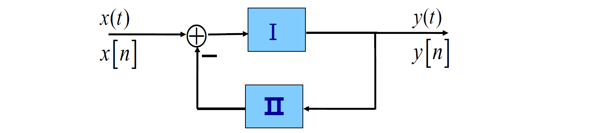

## 1.1 连续时间与离散时间信号

**信号的分类**：

- 连续时间信号：$x(t),x(t_1,t_2)...$
- 离散时间信号：$x[n],x[n_1,n_2]...$
- 连续时间信号在离散时刻点上的样本可以构成一个离散时间信号

**信号的能量与功率**：

- 连续时间信号：在$[t_1,t_2]$区间
	- 能量定义为$E=\int_{t_1}^{t_1}|x(t)|^2 \mathbb dt$
	- 平均功率定义为$P=\frac{1}{t_2-t_1}\int_{t_1}^{t_2}|x(t)|^2\mathbb dt$
- 离散时间信号：在$[n_1,n_2]$区间
	- 能量定义为$E=\sum_{n=n_1}^{n_2}|x[n]|^2$
	- 平均功率定义为$P=\frac{1}{n_2-n_1+1}\sum_{n=n_1}^{n_2}|x[n]|^2$
- 在无限区间定义信号的总能量和平均功率：
	- 连续时间：
		- $E_\infty=\lim_{T\to\infty}\int_{-T}^{T}|x(t)|^2\mathbb dt=\int_{-\infty}^{\infty}|x(t)|^2\mathbb dt$
		- $P_{\infty}=\lim_{T\to\infty}\frac{1}{2T}\int_{-T}^{T}|x(t)|^2\mathbb dt$
	- 离散时间
		- $E_{\infty}=\lim_{N\to\infty}\sum_{-N}^{N}|x[n]|^2=\sum_{-\infty}^{\infty}|x[n]|^2$
		- $P_{\infty}=\lim_{N\to\infty}\frac{1}{2N+1}\sum_{-N}^{N}|x[n]|^2$

**三类重要信号**：

- 能量信号：$E_\infty<\infty,P_\infty=0$
- 功率信号：$E_\infty=\infty,0<P_\infty<\infty$
- $E_\infty=\infty,P_\infty=\infty$

**周期信号与非周期信号**：

- 周期信号：$x(t+T)=x(t)$，$x[n+N]=x[n]$

## 1.2 自变量变换

**时移变换**：

- $x(t)\to x(t-t_0)$：
	- 当$t_0>0$时，信号右移$t_0$
	- 当$t_0<0$时，信号左移$|t_0|$
- $x[n]\to x[n-n_0]$：
	- 当$n_0>0$时，信号右移$n_0$
	- 当$n_0<0$时，信号左移$|t_0|$

**反转变换**：

- $x(t)\to x(-t)$：信号以t=0为轴呈镜像对称
- $x[n]\to x[-n]$：（与连续时间信号的情况相同）

**尺度变换**：

- $x(t)\to x(at)$：
	- $a>1$时，$x(at)$将$x(t)$在时间上压缩a倍
	- $0<a<1$时，$x(at)$将$x(t)$在时间上扩展$1/a$倍
- 由于离散时间信号的自变量只能取整数值，因而尺度变换只针对连续时间信号而言
	- $x[2n]$是从$x[n]$中抽出自变量取偶数时的各个点组成，这个过程称为对信号$x[n]$的**抽取**

**周期信号与非周期信号**：

- 周期信号：$x(t+T)=x(t)$，$x[n+N]=x[n]$
	- 满足此关系的正实数（正整数）中最小的一个称为信号的**基波周期$T_0(N_0)$**
	- $x(t)=c$可视为周期信号，但是其基波周期没有准确定义
	- $x[n]=c$可视为周期信号，其基波周期为$N_0=1$

**奇信号与偶信号**：

- 对实信号而言：
	- 如果有$x(-t)=x(t)$，$x[-n]=x[n]$，则称为偶信号（镜像偶对称）
	- 如果有$x(-t)=-x(t)$，$x[-n]=-x[n]$，则称为奇信号（镜像奇对称）
- 对复信号而言：
	- 如果有$x(t)=x^*(t)$，$x[n]=x^*[-n]$，则称为共轭偶信号
	- 如果有$x(t)=-x^*(t)$，$x[n]=-x^*[-n]$，则称为共轭奇信号

**定理**：任何信号都能分解成一个奇信号与一个偶信号之和。

- 【连续、实信号】$x_e(t)=\frac{1}{2}[x(t)+x(-t)]$，$x_o=\frac{1}{2}[x(t)-x(-t)]$
- 【离散、实信号】$x_e=\frac{1}{2}[x[n]+x[-n]]$，$x_o=\frac{1}{2}[x[n]-x[-n]]$
- 【连续、复信号】$x_e(t)=\frac{1}{2}[x(t)+x^*(-t)]$，$x_o=\frac{1}{2}[x(t)-x^*(-t)]$
- 【离散、复信号】$x_e=\frac{1}{2}[x[n]+x^*[-n]]$，$x_o=\frac{1}{2}[x[n]-x^*[-n]]$

## 1.3 复指数信号与正弦信号

### 1.3.1 连续时间复指数信号与正弦信号

$x(t)=Ce^{at}$，其中$C$、$a$为复数

**实指数信号**：$C$、$a$为实数

- $a>0$，呈单调指数上升；$a<0$，呈单调指数下降；$a=0$，$x(t)=C$为常数

**周期性复指数信号与正弦信号**：$a=j\omega_0$，不失一般性取$C=1$

- $x(t)=e^{j\omega_0t}=\cos\omega_0t+j\sin\omega_0t$
- 实部与虚部都是正弦信号
- $x(t)$是周期的，基波周期为$T_0=\frac{2\pi}{|\omega_0|}$
- 一般情况下，$x(t)=A\cos(\omega_0t+\phi)=\frac{A}{2}e^{j\phi}e^{j\omega_0t}+\frac{A}{2}e^{-j\phi}e^{-j\omega_0t}$
	- 基波周期为$T_0=\frac{2\pi}{|\omega_0|}$，基波频率为$\omega_0$
	- 当$\omega_0=0$时，通常称为直流信号
- 对$x(t)=e^{j\omega_0t}$而言，在一个周期内的能量为：$E_T=\int_{0}^{T_0}|e^{j\omega_0t}|^2dt=\int_{0}^{T_0}1\cdot dt=T_0$，平均功率为1

**成谐波关系的复指数信号集**：

- $\phi_k(t)=\{e^{jk\omega_0t}\},k=0,\pm1,\pm2,...$
- 该信号集中每个信号都是周期的，频率分别为$k\omega_0$，因而称它们成**谐波关系**
- 信号集内信号的基波频率为$\omega_0$，基波周期为$T_0$。各谐波的周期分别为$T_k=\frac{2\pi}{|k\omega_0|}$，公共周期为$T_0=\frac{2\pi}{|\omega_0|}$
- k取任意整数时，该信号集内所有信号都是彼此独立的。只有该信号集内所有信号才能构成一个完备的正交函数集。

**一般复指数信号**：

- $x(t)=Ce^{at}$，其中$C$、$a$均为复数
- 令$C=|C|e^{j\theta}$，$a=r+j\omega_0$，则$x(t)=|C|e^{j\theta}e^{rt}e^{j\omega_0t}=|C|e^{rt}e^{j(\omega_0t+\theta)}$
- 该信号可看作振幅按实指数信号规律变化的周期性复指数信号，其实部与虚部都是振幅呈实指数规律变化的正弦震荡
	- $r>0$时，指数增长的正弦震荡
	- $r<0$时，指数衰减的正弦震荡
	- $r=0$时，等幅的正弦震荡

### 1.3.2 离散时间复指数信号与正弦信号

$x[n]=C\alpha^{n}$，$C$、$\alpha$一般为复数

**实指数信号**：$C$、$\alpha$均为实数

- $\alpha>1$时，单调指数增长
- $a<1$时，单调指数衰减
- $-1<\alpha<0$时，摆动指数衰减
- $\alpha<-1$时，摆动指数增长

**正弦信号**：

- $x[n]=e^{j\omega_0n}$，其中$\omega_0$为实数
- $x[n]=e^{j\omega_0n}=\cos\omega_0n+j\sin\omega_0n$
- 离散时间正弦信号不一定是周期的

**一般复指数信号**：

- 令$C=|C|e^{j\theta}$，$\alpha=|\alpha|e^{j\omega_0}$则，$x[n]|C||\alpha|^ne^{j(\omega_0n+\theta)}=|C||\alpha|^n[\cos(\omega_0n+\theta)+j\sin(\omega_0n+\theta)]$
- 实部与虚部都是幅度按指数规律变化的正弦序列

### 1.3.3 离散时间复指数序列的周期性

**定理**：离散时间复指数序列$x[n]=e^{j\omega_0n}$不一定是周期的。如果是周期的，则一定满足$\frac{\omega_0}{2\pi}=\frac{m}{N}$，即$\omega_0$与$2\pi$的比值为有理数时才具有周期性。

- $N=\frac{2\pi}{\omega_0}m$，即基波周期
- $\omega=\frac{2\pi}{N}=\frac{\omega_0}{m}$，即基波频率

**谐波信号集**：

- $\phi_k[n]=\{e^{j\frac{2\pi}{N}kn}\},k=0,\pm1,\pm2,...$
- 信号集中每一个信号都以N为周期
- k=0称为直流分量，k=1称为基波分量，k=2称为二次谐波分量...
- 每个分量的频率都是$\frac{2\pi}{N}$的整数倍
- 信号集中只有N个信号是独立的（$\phi_{k+N}[n]=\phi_k[n]$）

|          $e^{j\omega_0t}$           |                      $e^{j\omega_0n}$                       |
| :---------------------------------: | :---------------------------------------------------------: |
|      $\omega_0$不同，信号不同       |             频率相差$2\pi$的整数倍时，信号相同              |
|  对任何$\omega_0$，信号都是周期的   | 仅当满足$\frac{\omega_0}{2\pi}=\frac{m}{N}$时，信号是周期的 |
| 基波频率$\omega_0=\frac{2\pi}{T_0}$ |     基波频率$\omega=\frac{\omega_0}{m}=\frac{2\pi}{N}$      |
|            基波周期$T_0$            |                         基波周期$N$                         |

## 1.4 单位冲激与单位阶跃

### 1.4.1 离散时间单位脉冲与单位阶跃

**单位脉冲序列**：$\delta[n]=\begin{cases}1&n=0\\0&n\neq0\end{cases}$

**单位阶跃序列**：$u[n]=\begin{cases}1&n\geq0\\0&n<0\end{cases}$

**二者关系**：

- $\delta[n]=u[n]-u[n-1]$
- $u[n]=\sum_{k=-\infty}^{n}\delta[k]=\sum_{k=0}^{\infty}\delta[n-k]$:warning:
- $x[n]\delta[n]=x[0]\delta[n]$，$x[n]\delta[n-n_0]=x[n_0]\delta[n-n_0]$
	- $\delta[n]$具有提取离散时间信号样本的作用

### 1.4.2 连续时间单位阶跃与单位冲激

**单位阶跃**：$u(t)=\begin{cases}1&t>0\\0&t<0\end{cases}$

**单位冲激**：$\delta(t)=\frac{du(t)}{dt}$，$u(t)=\int_{-\infty}^{t}\delta(\tau)d\tau$

- 定义不严密，$u(t)$在t=0处不连续，因此此处不可导
- $u_{\Delta}(t)$，$\delta_\Delta(t)$
- $\int_{-\infty}^{\infty}\delta(t)dt=1$，$u(t)=\int_{-\infty}^{t}\delta(\tau)d\tau=\int_{0}^{\infty}\delta(t-\tau)d\tau$
- $x(t)\delta(t)=x(0)\delta(t)$，$x(t)\delta(t-t_0)=x(t_0)\delta(t-t_0)$
	- $\delta(t)$具有提取连续时间信号样本的作用

## 1.5 连续时间与离散时间系统

### 1.5.1 系统

**系统**：若干相互依赖、相互作用的食物所组成的具有一定功能的整体

**连续时间系统**：输入信号和输出响应都是连续时间信号的系统

**离散时间系统**：输入信号和输出响应都是离散时间信号的系统

### 1.5.2 系统的互联

**级联**：

**并联**：

**反馈联结**：

## 1.6 系统的基本性质

### 1.6.1 记忆/无记忆

- **无记忆系统**：任何时刻，系统的输出只与当前时刻的输入有关，而与该时刻外的输入无关，则该系统为无记忆系统
- **记忆系统**：...
- **恒等系统**：在无记忆系统中存在一种特例，任何时刻系统的输出响应与输入信号都相同，则该系统为恒等系统

### 1.6.2 可逆/不可逆

- **可逆系统**：如果一个系统对任何不同的输入都能产生不同的输出，即输入与输出一一对应，则该系统为可逆系统
- **不可逆系统**：如果一个系统对两个或两个以上的不同输入产生相同输出，则该系统为不可逆系统
- **逆系统**：如果一个可逆系统与另一个系统级联构成一个恒等系统，则后者是前者的逆系统

### 1.6.3 因果/非因果

- **因果系统**：如果一个系统在任何时刻的输出都只与当时这个时刻及以前的输入有关，与该时刻以后的输入无关，则系统是因果的
- **非因果系统**：...
	- 一般说来，非因果系统是物理不可实现的
	- 对非实时处理信号的离散时间系统或信号的自变量不具有时间概念的情况下，因果性并不一定是系统能否物理实现的先决条件。

### 1.6.4 稳定/不稳定

- **稳定系统**：如果一个系统当输入有界时，产生的输出也是有界的，则该系统是稳定系统
- **不稳定系统**：...

### 1.6.5 时变/时不变

- **时不变系统**：如果一个系统当输入信号有一个时移，输出响应也产生同样的时移，除此之外输出响应没有任何变化，则该系统是时不变系统，即$x(t)\to y(t), \ x(t-t_0)=y(t-t_0)$
- **时变系统**：...

**检验一个系统时不变性的步骤**：

1. 令输入为$x_1(t)$，根据系统的描述，确定此时的输出$y_1(t)$
2. 将输入信号变为$x_2(t)$，再根据系统的描述确定输出$y_2(t)$
3. 令$x_2(t)=x_1(t-t_0)$，根据自变量变换，检验$y_1(t-t_0)$是否等于$y_2(t)$

### 1.6.6 线性/非线性

- **线性**：如果$x_1(t)\to y_1(t),x_2(t)\to y_2(t)$，且有$ax_1(t)+bx_2(t)\to ay_1(t)+by_2(t)$，则该系统是线性的
- **非线性**：...

**齐次性**、**可加性**

**线性性质的应用**：若$x(t)=\sum_{k}a_kx_k(t),x_k(t)\to y_k(t)$，则$y(t)=\sum_{k}a_ky_k(t)$

**增量线性系统**：这类系统不满足线性系统要求，但是其输出响应的增量与输入信号的增量之间满足线性性质

- 任何增量线性系统都可以等效为一个线性系统$y_1(t)$+与输入无关$y_0(t)$的响应
	- 当$y_0(t)=0$时，系统的输出响应完全由$y_1(t)$决定，此时系统处于零初始状态，$y_1(t)$称为**零状态响应**
	- 当$x(t)=0$时，有$y_1(t)=0,y(t)=y_0(t)$，此时将$y_0(t)$称为**零输入响应**
- 增量线性系统的响应包括零输入响应、零状态响应

根据线性系统的齐次性，线性系统当输入为0（无输入）时，系统的输出响应为0，即线性系统的**零输入-零输出**特性