## 2.1 离散时间LTI系统：卷积和

### 2.1.1 单位脉冲表示离散时间信号

对任何离散时间信号$x[n]$，如果每次从其中取出一个点，就可以将信号拆开，每次取出的每一个点都可以表示为不同加权、不同位置的单位脉冲。

- $x[n]=\sum_{k=-\infty}^{\infty}x[k]\delta[n-k]$

### 2.1.2 卷积和

**定理**：只要得到了LTI系统对$\delta[n]$的响应$h[n]$，就可以得到LTI系统对任何输入信号$x[n]$的响应：$y[n]=\sum_{k=-\infty}^{\infty}x[k]h[n-k]=x[n]*h[n]$

- 一个LTI系统可以完全由它的单位脉冲响应来表征。这种求得系统响应的运算关系称为**卷积和**。

### 2.1.3 卷积和的计算

**卷积和**：$x[n]*h[n]=\sum_{k=-\infty}^{\infty}x[k]h[n-k]$

**计算步骤**：【图解法计算卷积和】

- 将$x[n]$和$h[n]$的n改为k，得到$x[k]$和$h[k]$
- 将其中一个信号翻转，例如将$h[k]$翻转得到$h[-k]$
- 将$h[-k]$平移n，其中$n>0$时图像右移，$n<0$时图像左移
- 将$x[k]$与$h[n-k]$相乘，对乘积后的图形进行求和

### * 2.1.3 列表法计算序列卷积和

【详见课件】

## 2.2 连续时间LTI系统：卷积积分

### 2.2.1 冲激信号表示连续时间信号

连续时间信号可以分解为一系列移位加权的单位冲激信号的线性组合，至少单位阶跃与单位冲激之间有如下关系：$u(t)=\int_{-\infty}^{t}\delta(\tau)d\tau=\int_{0}^{\infty}\delta(t-\tau)d\tau$

- **物理意义**：不同的连续信号都可以分解为冲激信号，只是它们的系数不同
- **实际应用**：当求解信号通过系统产生的响应时，只需要求解冲激信号通过该系统产生的响应，然后利用线性时不变系统的特性，进行迭加和延时得到响应

### 2.2.2 卷积积分

**定理**：若系统是时不变的，即$\delta(t)\to h(t),\delta(t-\tau)\to h(t-\tau)$，则系统对任意输入$x(t)$的响应可表示为$y(t)=\int_{-\infty}^{\infty}x(\tau)h(t-\tau)d\tau=x(t)*h(t)$

- 一个LTI系统可以完全由其单位冲激响应$h(t)$表征。这种求得系统响应的运算关系称为**卷积积分**

### 2.2.3 卷积积分的计算

**卷积积分**：$x(t)*h(t)=\int_{-\infty}^{\infty}x(\tau)h(t-\tau)d\tau$

**计算步骤**：

- 将$x(t)$和$h(t)$中的自变量由$t$改为$\tau$，得到$x(\tau)$和$h(\tau)$
- 将其中一个信号翻转，例如翻转$h(\tau)$得到$h(-\tau)$，再平移t
- 将$x(\tau)$与$h(t-\tau)$相乘，对乘积后的信号进行积分

## 2.3 线性时不变系统的性质

### 2.3.1 卷积积分与卷积和的性质

**交换律**：【单位冲激响应为$h(t)$的系统对输入$x(t)$产生的响应与单位冲激响应为$x(t)$的系统对输入$h(t)$产生的响应相同】

- $y[n]=x[n]*h[n]=h[n]*x[n]$
- $y(t)=x(t)*h(t)=h(t)*x(t)$

**分配律**：【两个LTI系统并联，总的单位脉冲（冲激）响应等于子系统单位脉冲（冲激）响应之和】

- $x[n]*(h_1[n]+h_2[n])=x[n]*h_1[n]+x[n]*h_2[n]$
- $x(t)*(h_1(t)+h_2(t))=x(t)*h_1(t)+x(t)*h_2(t)$

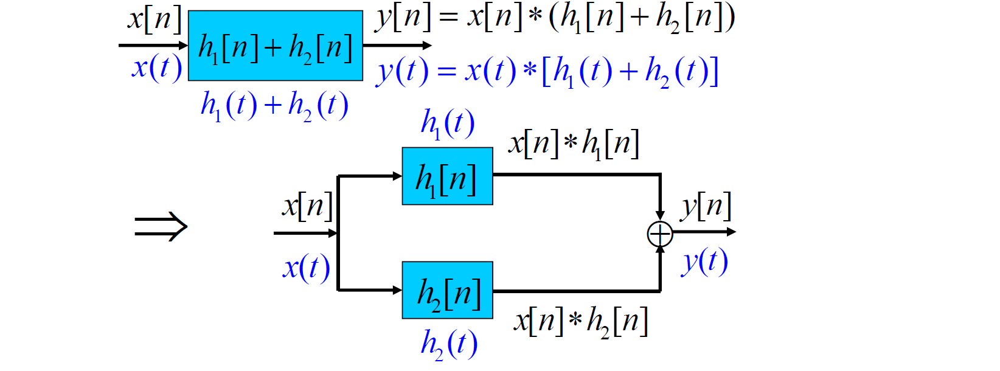

**结合律**：【两个LTI系统级联时，系统的总单位冲激（脉冲）响应等于各个子系统单位冲激（脉冲）响应的卷积】

- $(x[n]*h_1[n])*h2[n]=x[n]*(h_1[n]*h_2[n])$
- $(x(t)*h_1(t))*h_2(t)=x(t)*(h_1(t)*h_2(t))$

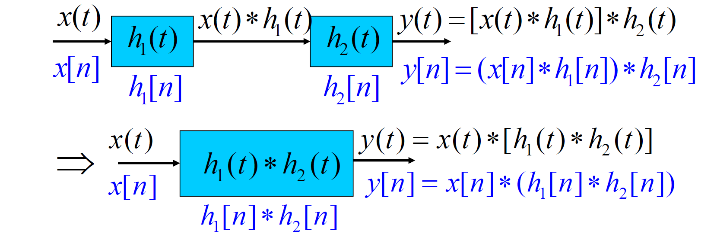

**tips**：$x[n]*h_1[n]*h_2[n]=x[n]*h_2[n]*h_1[n]$，$x(t)*h_1(t)*h_2(t)=x(t)*h_2(t)*h_1(t)$。前提条件是：系统必须是LTI系统，且所有卷积运算必须收敛

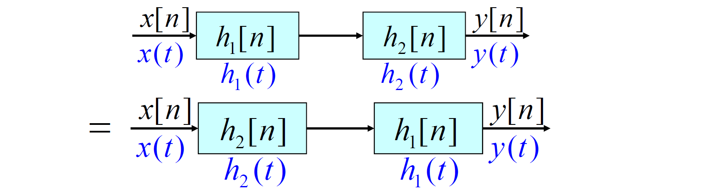

**其他性质【离散】**：$y[n]=x[n]*h[n]$

- 差分：$(x[n]-x[n-1])*h[n]=y[n]-y[n-1]$
- 求和：$(\sum_{k=-\infty}^{n}x[k])*h[n]=x[n]*(\sum_{k=-\infty}^{n}h[k])=\sum_{k=-\infty}^{n}y[k]$:warning:
- 时移：$x[n-n_0]*h[n]=x[n]*h[n-n_0]=y[n-n_0]$

**其他性质【连续】**：$y(t)=x(t)*h(t)$

- 微分：$y'(t)=x'(t)*h(t)=h(t)*(\delta(t)-\delta(t-T))=h(t)-h(t-T)$
- 积分：$y(t)=\int_{-\infty}^{t}y'(\tau)d\tau$

### 2.3.2 LTI系统的性质

**记忆性**：如果LTI系统是无记忆的，则在任何时刻n，$y[n]$都只能与n时刻的输入有关，和式中只能有k=n时的一项非零，因此必有$h[n-k]=0,k\neq n$，即$h[n]=0,n\neq 0$。无记忆系统的单位脉冲响应、冲激响应为$h[n]=k\delta[n]$、$h(t)=k\delta(t)$，此时$x[n]*h[n]=kx[n]$、$x(t)*h(t)=kx(t)$，k=1时为恒等系统；否则系统是记忆的

**可逆性**：如果LTI系统是可逆的，则一定存在一个逆系统，且逆系统也为LTI系统，二者级联构成恒等系统，即$h(t)*g(t)=\delta(t)$、$h[n]*g[n]=\delta[n]$。

- 累加器$h[n]=u[n]$是可逆LTI系统，其逆系统为差分器$g[n]=\delta[n]-\delta[n-1]$，但是差分器不可逆

**因果性**：当LTI系统为因果系统时，对任何时刻n，都只能取决于n时刻及以前时刻的输入，即所有$k>n$的项都必须为0，因此有$h[n-k]=0,k>n$或$h[n]=0,n<0$。对连续时间系统有$h(t)=0,t<0$

- LTI系统具有因果性的**充要条件**

**稳定性**：根据稳定性的定义，若$x[n]$有界，则$|x[n-k]|\leq A$；若系统稳定，则$y[n]$有界，即$y[n]=|\sum_{k=-\infty}^{\infty}h[k]x[n-k]|\leq\sum_{k=-\infty}^{\infty}|h[k]||x[n-k]|\leq A\sum_{k=-\infty}^{\infty}|h[k]|$。因此必有$\sum_{n=-\infty}^{\infty}|h[n]|<\infty$，$\int_{-\infty}^{\infty}|h(t)|dt<\infty$

- LTI系统具有稳定性的**充要条件**

**LTI系统的单位阶跃响应**：

对连续时间LTI和离散时间LTI有：$s(t)=u(t)*h(t)$，$s[n]=u[n]*h[n]$。

- $s(t)=\int_{-\infty}^{t}h(\tau)d\tau,h(t)=\frac{d}{dt}s(t)$
- $s[n]=\sum_{k=-\infty}^{n}h[k],h[n]=s[n]-s[n-1]$

（LTI系统的特性也可以用其单位阶跃响应描述）

## 2.4 微分和差分方程描述因果LTI系统

### 2.4.1 线性常系数微分方程

$\sum_{k=0}^{N}a_k\frac{d^{k}y(t)}{dt^k}=\sum_{k=0}^{M}\frac{d^kx(t)}{dt^k}$，$a_k$、$b_k$均为常数。通常求出通解$y_h(t)$和一个特解$y_p(t)$，则$y(t)=y_p(t)+y_h(t)$

- 特解$y_p(t)$是与输入$x(t)$同类型的函数，即找到**受迫响应**；通解$y_h(t)$是齐次方程的解，即$\sum_{k=0}^{N}a_k\frac{d^ky(t)}{dt^k}=0$的解，即找到**自然响应**
- 在特征根均为单阶根时，可得出齐次解的形式为$y_h(t)=\sum_{k=1}^{N}C_kd^{\lambda_kt}$，其中$C_k$待定

为了确定系数$C_k$，需要增加附加条件。当系统为线性系统时，引入**初始松弛条件**，满足零输入-零输出特性，即若$t<t_0,x(t)=0$，则$t<t_0$时$y(t)=0$。此时微分方程蜕变为齐次方程，因此其齐次解必须为0，即所有$C_k$均为0。

- 初始松弛条件并不表明在某一固定时刻点的零初始条件，而是在时间上调整这一点，，使得在输入变成非零之前，响应一直为零
- LCCDE具有一组全部为0的初始条件时，所描述的系统是线性时不变、且因果的。

### 2.4.2 线性常系数差分方程

$\sum_{k=0}^{N}a_ky[n-k]=\sum_{k=0}^{M}b_kx[n-k]$。

- 与微分方程相似，先求出特解$y_p[n]$，再求出通解$y_h[n]$
- LCCDE具有一组全部为0的初始条件时，所描述的系统是线性时不变、且因果的。

**改写**：

- $y[n]=\frac{1}{a_0}[\sum_{k=0}^{M}b_kx[n-k]-\sum_{k=1}^{N}a_ky[n-k]]$，可由$y[-1],y[-2],...,y[-N]$求出$y[0]$，进而由$y[0],y[-1],...,y[-N+1]$求出$y[1]$，依次可求出$n\geq0$时的解——**递归方程**
- 当$a_k=0,k\neq0$时，差分方程变为$y[n]=\sum_{k=0}^{M}\frac{b_k}{a_0}x[n-k]$。求解方程不需要迭代计算，称为**非递归方程**，此时相当于$h[n]=\frac{b_n}{a_0},0\leq n\leq M$
	- $h[n]$是有限长的，因而把这种方程描述的LTI系统称为**FIR系统**；将递归方程描述的系统称为**IIR系统**，此时单位脉冲响应为无限长序列

无论是微分方程还是差分方程，特解（受迫响应）是由输入信号完全决定，通解（自然响应）对应的部分与输入信号无关。增量线性系统的响应分为零状态响应和零输入响应。

### 2.4.3 由微分和差分方程描述的LTI系统的方框图表示

**由差分方程描述的LTI系统的方框图表示**：

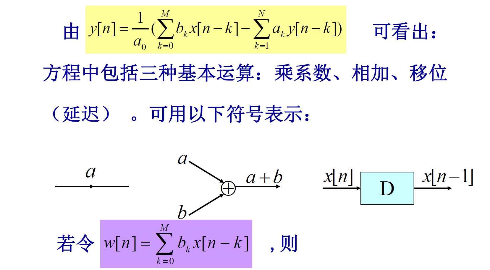

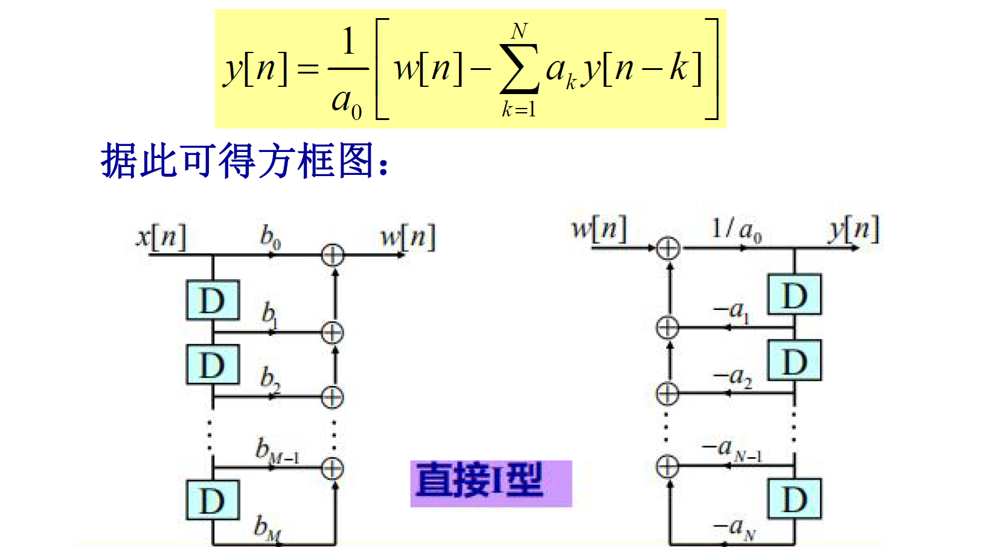

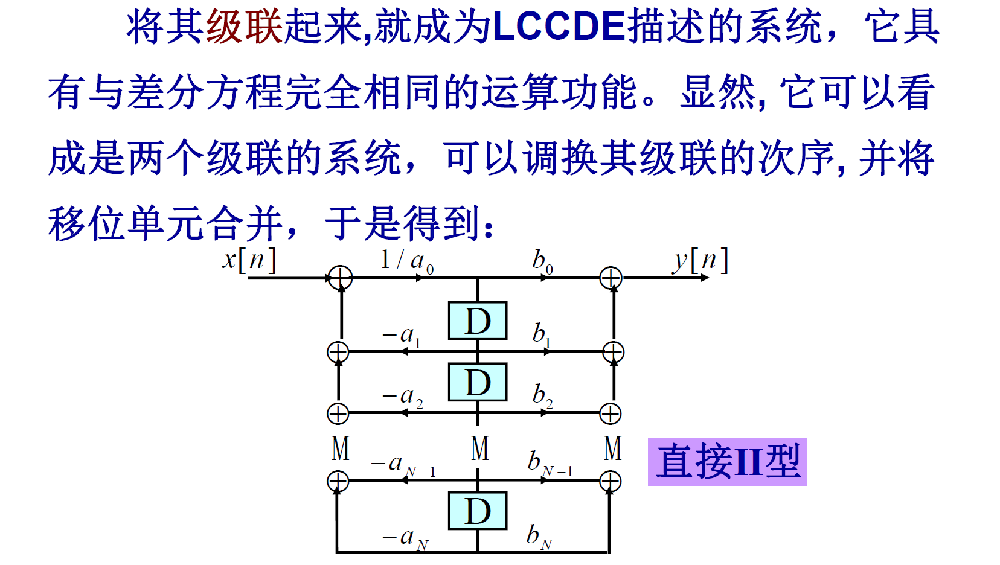

**由微分方程描述的LTI系统的方框图表示**：

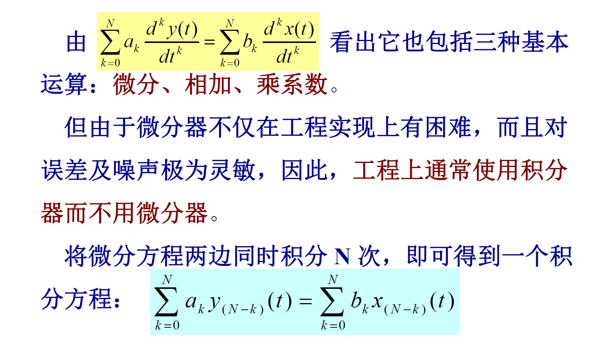

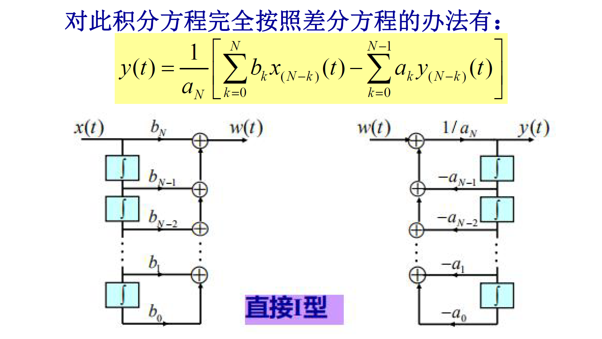

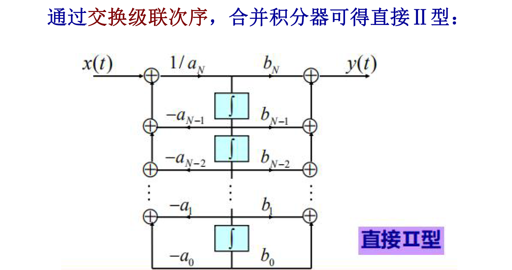

## 2.5 奇异函数

在介绍单位冲激时，无论是$\delta(t)=\frac{du(t)}{dt}$还是$\delta(t)\to\delta_\Delta(t)$都是不严格的，因为$\delta(t)$是一个理想化的非常规函数，称为**奇异函数**

### 2.5.1 通过卷积定义$\delta(t)$

**定义**：$x(t)=x(t)*\delta(t)$

**性质**：

- $\delta(t)*\delta(t)=\delta(t)$，$\delta(t-t_0)*\delta(t)=\delta(t-t_0)$
- 当$x(t)=1$时，$x(t)*\delta(t)=\int_{-\infty}^{\infty}\delta(\tau)d\tau=1$，因此$\int_{-\infty}^{\infty}\delta(t)dt=1$
- 由$g(-t)*\delta(t)=\int_{-\infty}^{infty}g(\tau-t)\delta(\tau)d\tau=g(-t)$，当t=0时，有$g(0)=\int_{-\infty}^{\infty}g(\tau)\delta(\tau)d\tau$。此式可作为积分运算下$\delta(t)$的定义式。:warning:

### 2.5.2 通过积分定义$\delta(t)$

**定义**：$g(0)=\int_{-\infty}^{\infty}g(t)\delta(t)dt$（分配函数的定义方法）

**推论**：

- 若$g(t)$为奇函数，则$g(0)=0$，因此$\delta(t)$为偶函数，即$\delta(t)=\delta(-t)$。令$g(\tau)=x(t-\tau)$，代入积分式得到：$x(t)=\int_{-\infty}^{\infty}x(t-\tau)\delta(\tau)d\tau=x(t)*\delta(t)$，即卷积下的定义
- 根据积分下的定义有：$g(0)f(0)=\int_{-\infty}^{\infty}g(t)f(t)\delta(t)dt=\int_{-\infty}^{\infty}f(0)g(t)\delta(t)dt$，因此有$f(t)g(t)=f(0)\delta(t)$，若$f(t)=t$，则有$t\delta(t)=0$。因此若有$tf_1(t)=tf_2(t)$，则$f_1(t)=f_2(t)+C\delta(t)$

### 2.5.3 单位冲激偶及其他奇异函数

**定义**：理想微分器的单位冲激响应应该是$\delta(t)$的微分，记为$u_1(t)=\frac{d}{dt}\delta(t)$，从卷积运算或LTI系统分析的角度有：$x(t)*u_1(t)=\frac{d}{dt}x(t)$，所以$u_1(t)$称为单位冲激偶。

**推论**：

- 当$x(t)=1$时，有：$\int_{-\infty}^{\infty}x(t-\tau)u_1(\tau)d\tau=\int_{-\infty}^{\infty}u_1(\tau)d\tau=0$，因此$\int_{-\infty}^{\infty}u_1(t)dt=0$

- 考察$g(-t)*u_1(t)=\int_{-\infty}^{\infty}g(\tau-t)u_1(\tau)d\tau=\frac{d}{dt}g(-t)=-\frac{d}{d\sigma}g(\sigma)|_{\sigma=-t}$。当t=0时，有$-g'(0)=\int_{-\infty}^{\infty}g(\tau)u_1(\tau)d\tau$，此积分可作为$u_1(t)$在积分意义下的定义

- 若$g(t)$是一个偶函数，则$g'(0)=0$。由此可知$u_1(t)$是奇函数

- 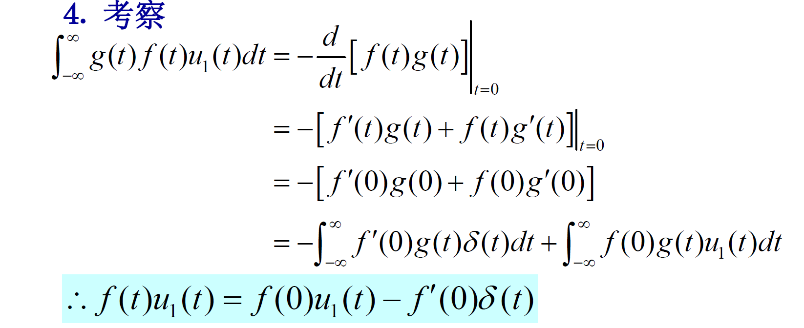

- 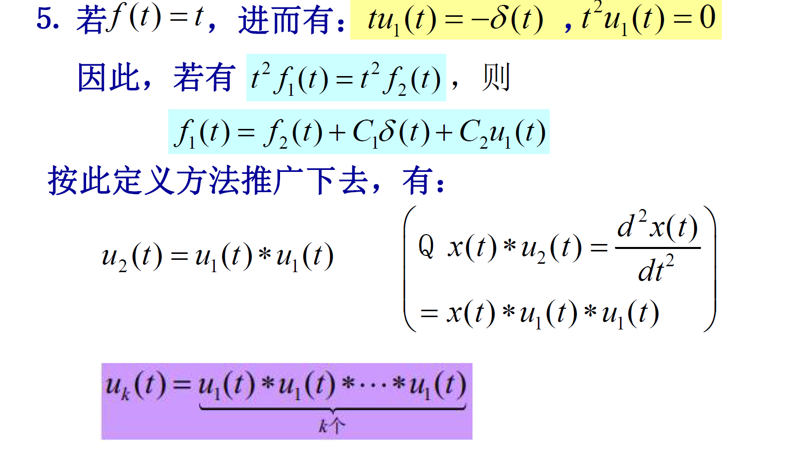

	

### 2.5.4 $\delta(t)$的积分

如果用$u_0(t)\Leftrightarrow\delta(t)$，则有$u_{-1}(t)\Leftrightarrow u(t)$，$u_{-1}(t)=\int_{-\infty}^{t}\delta(\tau)d\tau=u(t)$。$u_{-1}(t)$是理想积分器的单位冲激响应，$x(t)*u_{-1}(t)=\int_{-\infty}^{t}x(\tau)d\tau$，因此$u_{-2}(t)=u_{-1}(t)*u_{-1}(t)=\int_{-\infty}^{t}u(t)dt=tu(t)$，称为**单位斜坡函数**

