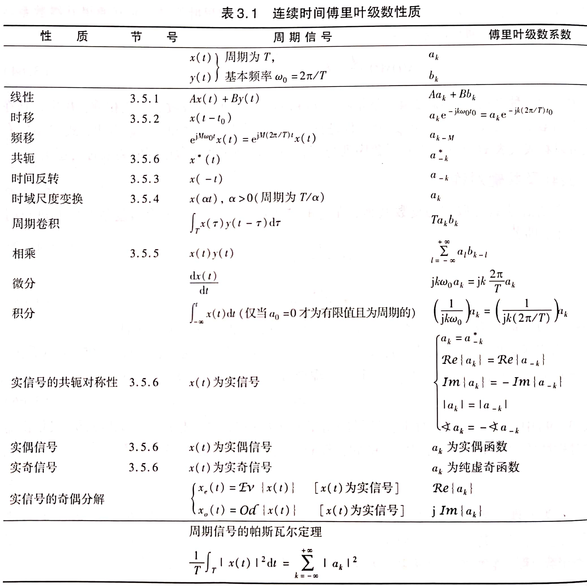
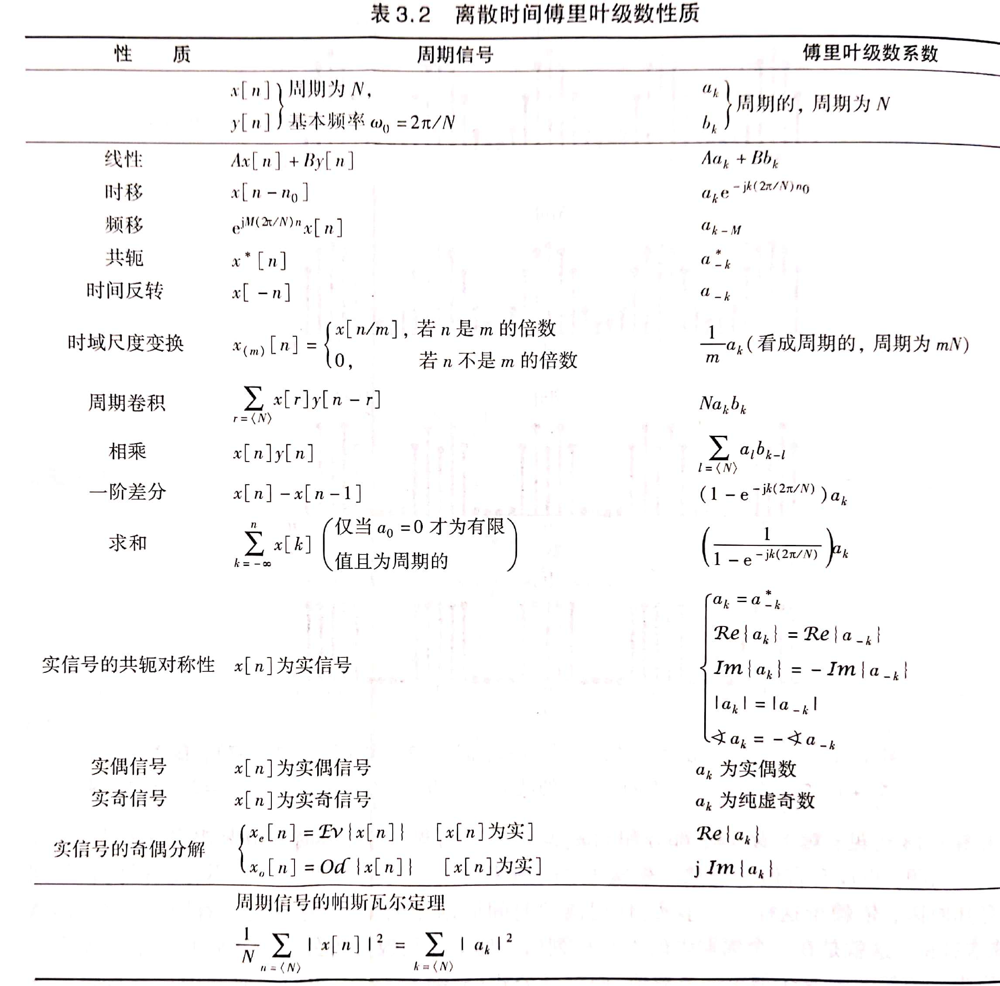

##  * 3.1 历史回顾

## 3.2 LTI系统对复指数信号的响应

考察$x(t)=e^{st},x[n]=z^n$，由时域分析得：$\begin{cases}y(t)=\int_{-\infty}^{\infty}e^{s(t-\tau)}h(\tau)d\tau=e^{st}\int_{-\infty}^{\infty}h(\tau)e^{-s\tau}d\tau=H(s)e^{st}\\y[n]=\sum_{k=-\infty}^{\infty}z^{n-k}h[k]=z^n\sum_{\infty}^{\infty}h[k]z^{-k}=H(z)z^n\end{cases}$

可见LTI系统对复指数信号的响应容易求出

**特征函数**：如果系统对某一信号的响应是该信号乘以一个常数，则称该信号是这个系统的特征函数，系统对该信号加权的常数称为系统与特征函数相对应的特征值。

- 复指数函数$e^{st}、z^n$是一切LTI系统的特征函数，$\begin{cases}H(s)=\int_{-\infty}^{\infty}h(t)e^{-st}dt\\H(z)=\sum_{-\infty}^{\infty}h[n]z^{-n}\end{cases}$分别为LTI与复指数信号相对应的特征值
- 只有复指数函数才能称为一切LTI系统的特征

## 3.3 连续时间周期信号的傅里叶级数表示

### 3.3.1 连续时间傅里叶级数

成谐波关系的复指数信号集$\phi_k(t)=\{e^{jk\omega_0t}\}$，其中每个信号都是以$\frac{2\pi}{|k\omega_0|}$为周期，公共周期为$\frac{2\pi}{|\omega_0|}$，且该集合中所有信号是彼此独立的。

- 对于$x(t)=\sum_{-\infty}^{\infty}a_ke^{jk\omega_0t}$显然也是以$\frac{2\pi}{|\omega|}$为周期的。该级数就是**傅里叶级数**，$a_k$称为**傅里叶级数的系数**
- 这表明用傅里叶级数可表示连续时间周期信号，即连续时间周期信号能够分解为无数个复指数谐波分量的线性组合
- $e^{\pm jk\omega_0t}$称为第k次谐波，$a_0$称为直流分量

### 3.3.2 频谱的概念

信号集$\phi_k(t)$中，除了呈谐波关系外，每个信号随时间t的变化规律都是一样的，差别仅仅是频率不同。在傅里叶级数中，各个谐波分量的区别仅仅是幅度和频率的不同。**频谱图**实际就是将$a_k$随频率的分布表示出来，即$a_k\sim\omega$的关系。由于信号的频谱完全代表了信号，因此这种表示信号的方法称为**频域表示法**

### 3.3.3 傅里叶级数的其他形式

- 若$x(t)$是实信号，则有$x(t)=x^*(t)$，因此有$a_k=a^*_{-k}$
	- 若$a_k=A_ke^{j\theta_k}$，则$a_0$为实数，于是$A_k=A_{-k},\theta_k=-\theta_{-k}$，即$a_k$的模关于k偶对称，幅角关于k奇对称
		- $x(t)=a_0+2\sum_{k=1}^{\infty}A_kcos(k\omega_0t+\theta_k)$
	- 若$a_k=B_k+jC_{k}$，则有$B_k=B_{-k},C_k=-C_{-k}$，即$a_{k}$的实部关于k偶对称，虚部关于k奇对称
		- $x(t)=a_0+2\sum_{k=1}^{\infty}[B_k\cos k\omega_0t-C_k\sin k\omega_0t]$

### 3.3.4 连续时间傅里叶级数系数的确定

$\begin{cases}x(t)=\sum_{-\infty}^{\infty}a_ke^{jk\omega_0t}\\a_k=\frac{1}{T_0}\int_{T_0}x(t)e^{-jk\omega_0t}dt,a_0=\frac{1}{T_0}\int_{T_0}x(t)dt\end{cases}$

### 3.3.5 周期性矩形脉冲信号的频谱

$a_k=\frac{2T_1}{T_0}\frac{\sin k\omega_0T_1}{k\omega_0T_1}=\frac{2T_1}{T_0}Sa(k\omega_0T_1)=\frac{2T_1}{T_0}sinc(\frac{2T_1}{T_0}k)$

（$Sa(x)=\frac{\sin x}{x}$，$sinc(x)=\frac{\sin \pi x}{\pi x}$）

- $\frac{2T_1}{T_0}$称为占空比

## 3.4 连续时间傅里叶级数的收敛

**Dirichlet条件**：

- $\int_{T_0}|x(t)|dt<\infty$在任何周期内信号绝对可积
- 在任何有限区间内，只有有限个极值点，且极值点为有限值
- 在任何有限区间内，只有有限个第一类间断点

## 3.5 连续时间傅里叶级数的性质

**线性**：若$x(t)$和$y(t)$都是以T为周期的信号，且$x(t)\stackrel{FS}{\longleftrightarrow}a_k,y(t)\stackrel{FS}{\longleftrightarrow}b_k$，则$Ax(t)+By(t)\stackrel{FS}{\longleftrightarrow}Aa_k+Bb_k$

**时移**：若$x(t)$是以T为周期的信号，且$x(t)\stackrel{FS}{\longleftrightarrow}a_k$，则$x(t-t_0)\stackrel{FS}{\longleftrightarrow}a_ke^{-jk\omega_0t_0},\omega_0=\frac{2\pi}{T}$

**反转**：若$x(t)$是以T为周期的信号，且$x(t)\stackrel{FS}{\longleftrightarrow}a_k$，则$x(-t)\stackrel{FS}{\longleftrightarrow}a_{-k}$

**尺度变换**：若$x(t)$是以T为周期的信号，且$x(t)\stackrel{FS}{\longleftrightarrow}a_k$，则$x(at)$以$\frac{T}{a}$为周期，于是$x(at)\stackrel{FS}\longleftrightarrow b_k=a_k$

**相乘**：若$x(t)$和$y(t)$都是以T为周期的信号，且$x(t)\stackrel{FS}{\longleftrightarrow}a_k,y(t)\stackrel{FS}{\longleftrightarrow}b_k$，则$x(t)y(t)\stackrel{FS}\longleftrightarrow a_k*b_k$

**共轭对称性**：若$x(t)$是以T为周期的信号，且$x(t)\stackrel{FS}{\longleftrightarrow}a_k$，则$x^*(t)\stackrel{FS}\longleftrightarrow a^*_{-k}$

- 对于实信号，有$a_k=a^*_{-k}$
	- 当$x(t)$为实偶函数时，$a_k$为实偶函数
	- 当$x(t)$为实奇函数时，$a_k$为虚奇函数

**Parseval定理**：$\frac{1}{T}\int_{T}|x(t)|^2dt=\sum_{k=-\infty}^{\infty}|a_k|^2$

- 表明一个周期信号的平均功率等于其所有谐波分量的平均功率之和

## 3.6 离散时间周期信号的傅里叶级数表示

### 3.6.1 离散时间傅里叶级数（DFS）

考察呈谐波关系的复指数信号集$\phi_k[n]=\{e^{j\frac{2\pi}{N}kn}\}$，该信号集中每个信号都以N为周期，且只有N个信号是彼此独立的。

- $x[n]=\sum_{k=<n>}a_ke^{j\frac{2\pi}{N}kn}$，其中k为N个相连的整数，该级数称为**离散时间傅里叶级数**
- $a_k$也称为周期信号的**频谱**
- 一个周期为N的序列能够由N个独立的信号线性组合起来

### 3.6.2 傅里叶级数系数的确定

$\begin{cases}x[n]=\sum_{k=<N>}a_ke^{j\frac{2\pi}{N}kn}\\a_k=\frac{1}{N}\sum_{n=<N>}x[n]e^{-j\frac{2\pi}{N}kn}\end{cases}$

### 3.6.3 周期性方波序列的频谱

$a_k=\begin{cases}\frac{1}{N}\frac{\sin\frac{\pi}{N}k(2N_1+1)}{\sin\frac{\pi}{N}k}&k\neq0,\pm N,\pm 2N,...\\\frac{2N_1+1}{N}&k=rN\end{cases}$

- 显然$a_k$的包络具有$\frac{\sin\beta x}{\sin x}$的形状

**特点**：

- 当$N_1$不变、$N$增大时，频谱的包络形状不变，只是幅度减小，谱线间隔变小
- 当$N_1$改变、$N$不变时，由于$a_k$的包络具有$\frac{\sin\beta x}{\sin x}$的形状，而$\beta=2N_1+1$，可知其包络形状发生变化
	- 当$N_1$减小时，包络的第一个零点会远离远点从而使频谱主瓣变宽
- 周期序列的频谱具有离散性、谐波性，当在$-\pi\sim\pi$考察时也具有收敛性。不同的是，离散时间周期信号的频谱具有*周期性*

### 3.6.4 DFS的收敛

DFS是有限项的级数，不存在收敛问题，也不会产生Gibbs现象

### 3.6.5 DFS的性质

**相乘**：$x[n]\stackrel{FS}\longleftrightarrow a_k,y[n]\stackrel{FS}\longleftrightarrow b_k$，则$x[n]y[n]\stackrel{FS}\longleftrightarrow c_k=\sum_{l=<N>}a_lb_{k-l}$   【周期卷积】

**差分**：$x[n]\stackrel{FS}\longleftrightarrow a_k$，则$x[n]-x[n-n_0]\stackrel{FS}\longleftrightarrow (1-e^{-jk\omega_0n_0})a_k$

**Paseval定理**：$x[n]\stackrel{FS}\longleftrightarrow a_k$，则$\frac{1}{N}\sum_{n=<N>}|x[n]|^2=\sum_{k=<N>}|a_k|^2$

- 一个周期信号的平均功率等于它的所有谐波分量功率之和
- 周期信号的功率既可以由时域求出，也可以由频域求出

## 3.7 傅里叶级数与LTI系统

**系统函数**：

- 连续时间系统：$H(s)=\int_{-\infty}^{\infty}h(t)e^{-st}dt$
- 离散时间系统：$H(z)=\sum_{n=-\infty}^{\infty}h[n]z^{-n}$

**连续时间LTI系统的频率响应**：当$s=j\omega$时，$H(j\omega)=\int_{-\infty}^{\infty}h(t)e^{-j\omega t}dt$

**离散时间LTI系统的频率响应**：当$z=e^{j\omega}$时，$H(e^{j\omega})=\sum_{n=-\infty}^{\infty}h[n]e^{-j\omega n}$

- $H(e^{j\omega})$对$\omega$而言是以$2\pi$为周期的

**推论**：$\begin{cases}y(t)=\sum_{k=-\infty}^{\infty}a_kH(jk\omega_0)e^{jk\omega_0t}\\y[n]=\sum_{k=<N>}a_kH(e^{j\frac{2\pi}{N}k})e^{j\frac{2\pi}{N}kn}\end{cases}$

