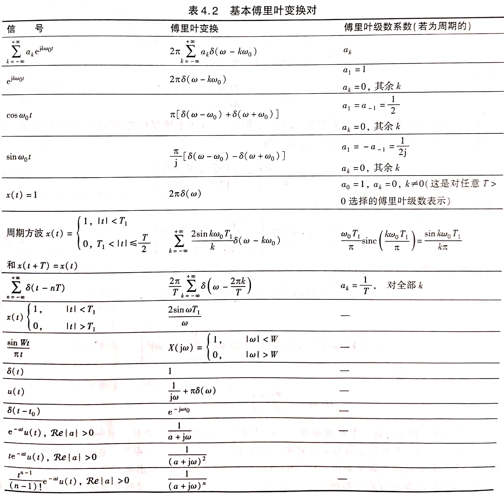
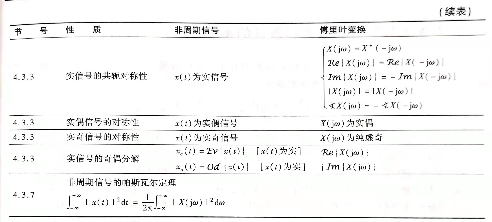

## 4.1 非周期信号的表示（连续时间傅里叶变换）

### 4.1.1 连续时间傅里叶变换

**连续时间傅里叶变换**：$X(j\omega)=\int_{-\infty}^{\infty}x(t)e^{-j\omega t}dt$

- 与傅里叶级数的关系：$a_k=\frac{1}{T_0}X(jk\omega_0)$
- 表明周期信号的频谱是它对应的非周期信号频谱的样本
- $X(j\omega)=\lim_{T_0\to \infty}T_0a_k=\lim_{f_0\to0}\frac{a_k}{f_0}$，具有频谱随频率分布的物理含义，因而$X(j\omega)$称为**频谱密度函数**

**傅里叶反变换**：$x(t)=\frac{1}{2\pi}\int_{-\infty}^{\infty}X(j\omega)e^{j\omega t}d\omega$

- 表明非周期信号可以分解为无数频率连续分布、振幅为$\frac{1}{2\pi}X(j\omega)d\omega$的复指数信号之和

**傅里叶变换对**：$\begin{cases}X(j\omega)=\int_{-\infty}^{\infty}x(t)e^{-j\omega t}dt\\x(t)=\frac{1}{2\pi}\int_{-\infty}^{\infty}X(j\omega)e^{j\omega t}d\omega\end{cases}$

周期信号的频谱是对应的非周期信号的样本，非周期信号的频谱是对应周期信号频谱的包络。

### 4.1.2 傅里叶变换的收敛

**需要满足两组条件**【充分条件】：

- 若$\int_{-\infty}^{\infty}|x(t)|^2dt<\infty$，则$X(j\omega)$存在，即能量有限的信号其傅里叶变换一定存在
- Dirichlet条件：
	- $\int_{-\infty}^{\infty}|x(t)|dt$，即绝对可积
	- 任何有限区间内，$x(t)$只能包含有限个极值点，且极值有限
	- 任何有限区间内，$x(t)$只能包含有限个第一类间断点

### 4.1.3 常用信号的傅里叶变换

信号在时域和频域之间存在相反的关系：信号在时域脉冲越窄，其频谱主瓣越宽，反之亦然。

### 4.1.4 信号的带宽

**信号的带宽**：

- **$|X(j\omega)|$下降到最大值的$\frac{1}{\sqrt{2}}$**时对应的频率范围，此时带内信号分量占有信号总能量的$\frac{1}{2}$
- 对包络为$Sa(x)$形状的频谱，通常定义**主瓣宽度**（即频谱第一个零点内的范围）为**信号带宽**
- 矩形脉冲中，脉宽乘带宽等于常数（脉宽带宽积）——频域与时域相反的关系

## 4.2 周期信号的傅里叶变换

**周期信号的傅里叶变换表示**：若$x(t)=\sum_{k=-\infty}^{\infty}a_ke^{jk\omega_0t}$，则$X(j\omega)=2\pi\sum_{k=-\infty}^{\infty}a_k\delta(\omega-k\omega_0)$

- 周期信号的傅里叶变换由一系列冲激组成，每一个冲激分别位于信号的各个谐波的频率处，其冲激强度正比于对应的傅里叶级数的系数$2\pi a_k$

## 4.3 连续时间傅里叶变换的性质

**线性**：若$x(t)\longleftrightarrow X(j\omega)，y(t)\longleftrightarrow Y(j\omega)$，则$ax(t)+by(t)\longleftrightarrow aX(j\omega)+bY(j\omega)$

**时移**：若$x(t)\longleftrightarrow X(j\omega)$，则$x(t-t_0)\longleftrightarrow X(j\omega)e^{-j\omega t_0}$

- 信号的时移只影响其相频特性，且只会增加一个线性时移

**共轭对称性**：若$x(t)\longleftrightarrow X(j\omega)$，则$x^*(t)\longleftrightarrow X^*(-j\omega)$

- 若$x(t)$是实信号，则$X(j\omega)=X^*(-j\omega)$，即模是偶函数，相位是奇函数
	- 若$x(t)$是实偶函数，则傅里叶变换为实偶函数
	- 若$x(t)$是实奇函数，则傅里叶变换为虚奇函数

**时域微分与积分**：若$x(t)\longleftrightarrow X(j\omega)$，则$\frac{dx(t)}{dt}\longleftrightarrow j\omega X(j\omega),\int_{-\infty}^{t}x(\tau)d\tau\longleftrightarrow \frac{1}{j\omega}X(j\omega)+\pi X(0)\delta(\omega)$

**时域和频域的尺度变换**：若$x(t)\longleftrightarrow X(j\omega)$，则$x(at)=\frac{1}{|a|}X(j\frac{\omega}{a})$

- 信号如果在时域扩展a倍，则带宽压缩a倍
- 时域中的压缩（扩展）对应频域中的扩展（压缩）

**对偶性**：若$x(t)\longleftrightarrow X(j\omega)$，则$X(jt)\longleftrightarrow2\pi x(-\omega)$

- 能够将时域的某些特点对偶到频域

**移频特性**：若$x(t)\longleftrightarrow X(j\omega)$，则$x(t)e^{j\omega_0t}\longleftrightarrow X[j(\omega-\omega_0)]$

**频域微分与积分**：若$x(t)\longleftrightarrow X(j\omega)$，则$-jt x(t)\longleftrightarrow \frac{d}{d\omega}X(j\omega),\frac{x(t)}{-jt}+\pi x(0)\delta(t)\longleftrightarrow \int_{-\infty}^{\omega}X(j\tau)d\tau$

**Parseval定理**：若$x(t)\longleftrightarrow X(j\omega)$，则$\int_{-\infty}^{\infty}|x(t)|^2dt=\frac{1}{2\pi}\int_{-\infty}^{\infty}|X(j\omega)|^2d\omega$

- 信号的能量既可以在时域求得，也可以在频域求得
- 由于$|X(j\omega)|^2$表示了信号能量在频域的分布，因此也称为**能量谱密度函数**

## 4.4 卷积性质

### 4.4.1 卷积特性

**卷积特性**：若$x(t)\longleftrightarrow X(j\omega),h(t)\longleftrightarrow H(j\omega),y(t)=x(t)*h(t)$，则$Y(j\omega)=X(j\omega)H(j\omega)$

- 由于$h(t)$的傅里叶变换$H(j\omega)$就是频率为$\omega$的复指数信号$e^{j\omega t}$通过LTI系统时，系统对输入信号在幅度上产生的影响，因此称为**系统的频率响应**
- 由于$h(t)$与$H(j\omega)$一一对应，因此$H(j\omega)$也能表征LTI系统，但是并非所有系统都存在$H(j\omega)$

### 4.4.2 LTI系统的频域分析法

**频域分析的步骤**：

1. 由$x(t)\longleftrightarrow X(j\omega)$
2. 根据系统的描述，求出$H(j\omega)$
3. $Y(j\omega)=X(j\omega)H(j\omega)$
4. $y(t)=F^{-1}[Y(j\omega)]$

## 4.5 相乘性质

**相乘性质**：若$x_1(t)\longleftrightarrow X_1(j\omega),x_2(t)\longleftrightarrow X_2(j\omega)$，则$x_1(t)x_2(t)\longleftrightarrow\frac{1}{2\pi}X_1(j\omega)*X_2(j\omega)$

- 两个信号在时域相乘，可以看作一个信号控制另一个信号的幅度，即幅度调制。其中一个信号称为载波，另一个信号称为调制信号

## 4.6 由线性常系数微分方程表征的系统

$\sum_{k=0}^{N}a_k\frac{d^{k}y(t)}{dt^k}=\sum_{k=0}^{M}b_k\frac{d^kx(t)}{dt^k}$

- 对两边进行傅里叶变换后得到：$\sum_{k=0}^{N}a_k(j\omega)^kY(j\omega)=\sum_{k=0}^{M}b_k(j\omega)^kX(j\omega)$
- $H(j\omega)=\frac{\sum_{k=0}^{M}b_k(j\omega)^k}{\sum_{k=0}^{N}a_k(j\omega)^k}$

对有理函数求傅里叶反变换通常采用**部分式展开**和**利用常用变换对**进行。