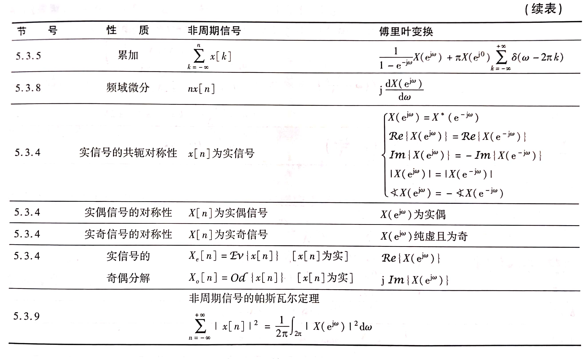

## 5.1 非周期信号的表示

### 5.1.1 从DFS到DTFT

**傅里叶变换对**：$\begin{cases}x[n]=\frac{1}{2\pi}\int_{2\pi}X(e^{j\omega})e^{j\omega n}d\omega\\X(e^{j\omega})=\sum_{n=-\infty}^{\infty}x[n]e^{-j\omega n}\end{cases}$

### 5.1.2 常用信号的离散时间傅里叶变换

### 5.1.3 DTFT的收敛问题

- $\sum_{n=-\infty}^{\infty}|x[n]|^2<\infty$，则级数以均方误差最小的原则收敛于$X(e^{j\omega})$
- $\sum_{n=-\infty}^{\infty}|x[n]|<\infty$，则$X(e^{j\omega})$存在，且级数一致收敛于$X(e^{j\omega})$

## 5.2 周期信号的DTFT

由DFS有$x[n]=\sum_{k=<N>}a_ke^{jk\omega_0 n}$，推得$X(e^{j\omega})=2\pi\sum_{k=-\infty}^{\infty}a_k\delta(w-\frac{2\pi}{N}k)$

- 与连续时间傅里叶变换中响应的形式是完全一致的

## 5.3 离散时间傅里叶变换的性质

**周期性**：若$x[n]\longleftrightarrow X(e^{j\omega})$，则$X(e^{j(\omega+2\pi)})=X(e^{j\omega})$

- DTFT与CTFT的不同点之一

**线性**：$ax_1[n]+bx_2[n]\longleftrightarrow aX_1(e^{j\omega})+bX_2(e^{j\omega})$

**时移与频移**：若$x[n]\longleftrightarrow X(e^{j\omega})$，则$\begin{cases}x[n-n_0]\longleftrightarrow X(e^{j\omega})e^{-j\omega n_0}\\x[n]e^{j\omega_0n}\longleftrightarrow X(e^{j(\omega-\omega_0)})\end{cases}$

**时域反转**：若$x[n]\longleftrightarrow X(e^{j\omega})$，则$x[-n]\longleftrightarrow X(e^{-j\omega})$

**共轭对称性**：若$x[n]\longleftrightarrow X(e^{j\omega})$，则$x^*[n]\longleftrightarrow X^*(e^{-j\omega})$

- 若$x[n]$是实信号，则$X^*(e^{j\omega})=X(e^{-j\omega})$
- 若$x[n]$是实偶信号，则$X(e^{j\omega})$是实偶函数
- 若$x[n]$是实奇信号，则$X(e^{j\omega})$是虚奇函数
- 若$x[n]=x_e[n]+x_o[n]$，则$\begin{cases}x_e[n]\longleftrightarrow Re[X(e^{j\omega})]\\x_o[n]\longleftrightarrow jIm[X(e^{j\omega})]\end{cases}$

**差分与求和**：$\begin{cases}x[n]-x[n-1]\longleftrightarrow (1-e^{-j\omega})X(e^{j\omega})\\\sum_{k=-\infty}^{\infty}\frac{X(e^{j\omega})}{1-e^{-j\omega}}+\pi X(e^{j0})\sum_{k=-\infty}^{\infty}\delta(\omega-2\pi k)\end{cases}$

- DTFT中$1-e^{-j\omega}$相当于CTFT中的$j\omega$

**时域扩展**：

- 定义$x_{(k)}[n]=\begin{cases}x[\frac{n}{k}]&n为k的整数倍\\0&其他n\end{cases}$
- $x_{(k)}[n]\longleftrightarrow X(e^{jk\omega})$

**频域微分**：$nx[n]\longleftrightarrow j\frac{dX(e^{j\omega})}{d\omega}$

**Parseval定理**：$\sum_{n=-\infty}^{\infty}|x[n]|^2=\frac{1}{2\pi}\int_{2\pi}|X(e^{j\omega})|^2d\omega$

- $|X(e^{j\omega})|^2$称为$x[n]$的**能量谱密度函数**
- DFS中，$|a_k|^2$称为**周期信号的功率谱**

## 5.4 卷积特性

**卷积特性**：若$y[n]=x[n]*h[n]$，则$Y(e^{j\omega})=X(e^{j\omega})H(e^{j\omega})$

- $H(e^{j\omega})$是系统的频率特性

## 5.5 相乘特性

**相乘特性**：若$y[n]=x_1[n]x_2[n]$，则$Y(e^{j\omega})=\frac{1}{2\pi}X_1(e^{j\omega})*X_2(e^{j\omega})$

- 由于$X_1(e^{j\omega})$和$X_2(e^{j\omega})$都是以$2\pi$为周期，因此上述卷积称为**周期卷积**

## 5.6 对偶性

**DFS的对偶性**：$\begin{cases}x[n]\stackrel{DFS}\longleftrightarrow a_k\\a_n\stackrel{DFS}\longleftrightarrow \frac{1}{N}x[-k]\end{cases}$

**DTFT与CFS的对偶**：若$x[n]\stackrel{DTFT}\longleftrightarrow X(e^{j\omega})$，则$X(e^{jt})\stackrel{CFS}\longleftrightarrow x[-k]$

- 利用这一对偶关系，可以将DTFT的若干性质对偶到CFS中，反之也可以

## 5.7 由线性常系数差分方程表征的系统

### 5.7.1 线性常系数差分方程

$\sum_{k=0}^{N}a_ky[n-k]=\sum_{k=0}^{M}b_kx[n-k]$

- $H(e^{j\omega})=\frac{Y(e^{j\omega})}{X(e^{j\omega})}=\frac{\sum_{k=0}^{M}b_ke^{-jk\omega}}{\sum_{k=0}^{N}a_ke^{-jk\omega}}$
- $h[n]$可由$H(e^{j\omega})$反变换得到

### 5.7.2 系统的频率响应

$H(e^{j\omega})$是系统单位脉冲响应的傅里叶变换，但并非所有LTI都存在频率响应

- 如果$\sum_{n=-\infty}^{\infty}|h[n]|^2<\infty$，则$H(e^{j\omega})$存在
- $H(e^{j\omega})$所表征的系统是稳定系统

### 5.7.3 LTI系统的频域分析方法

1. 由$x[n]\longleftrightarrow X(e^{j\omega})$
2. 根据系统的描述，求出$H(e^{j\omega})$
3. $Y(e^{j\omega})=X(e^{j\omega})H(e^{j\omega})$
4. $y(t)=F^{-1}[Y(e^{j\omega})]$

做傅里叶变换或反变换的主要方法是**部分式展开**、**利用傅里叶变换性质**以及**常用的变换对**

