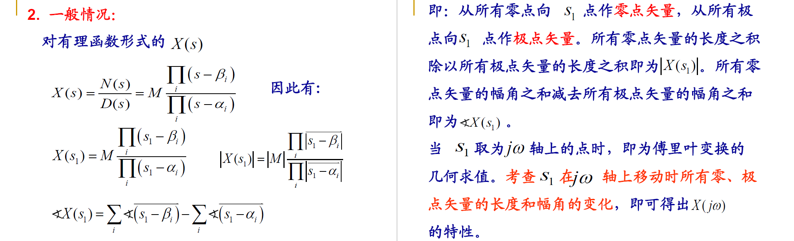
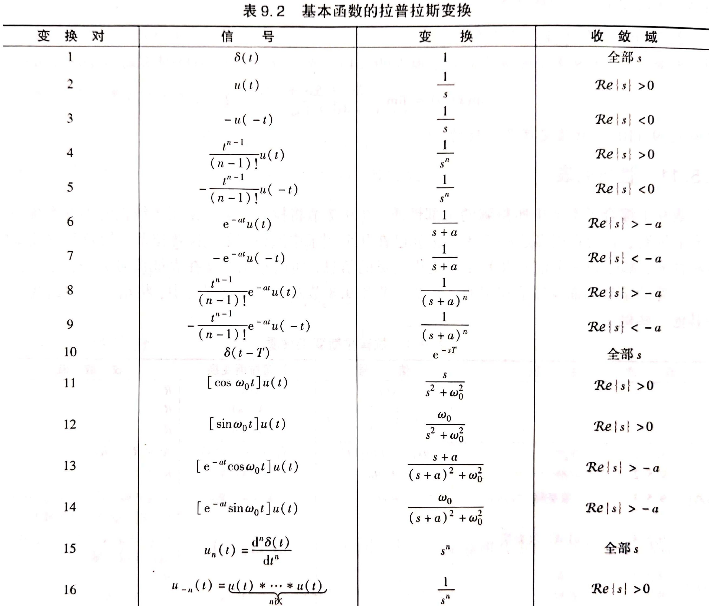

## 9.1 拉普拉斯变换

### 9.1.1 双边拉普拉斯变换

**双边拉普拉斯变换**：$X(s)=\int_{-\infty}^{\infty}x(t)e^{-st}dt,s=\sigma+j\omega$，称为$x(t)$的双边拉式变换

- 若$\sigma=0$，则为傅里叶变换
- 连续时间傅里叶变换是双边拉普拉斯变换在$\sigma=0$时的特例
- $X(s)=F[x(t)e^{-\sigma t}]$，即拉普拉斯变换是对傅里叶变换的推广

**特点**：

- 拉氏变换与傅里叶变换一样存在收敛问题，并非所有信号都有拉氏变换，也不是S平面上任何复数都能使拉氏变换收敛
- 拉氏变换的收敛域ROC
- 不同信号可能有相同的拉氏变换表达式，但是ROC不同
- 只有拉氏变换连同对应的ROC，才能与信号建立一一对应的关系
- 如果拉氏变换的ROC博爱阔$j\omega$轴，则$X(j\omega)=X(s)|_{s=j\omega}$

### 9.1.2 ROC与零极点图

拉氏变换的收敛域是各个收敛域的公共部分。ROC总是以平行于$j\omega$轴的直线作为边界，ROC的边界总是与$X(s)$的分母的根对应

- 若$X(s)$为有理函数$X(s)=\frac{N(s)}{D(s)}=M\frac{\prod_{i}(s-\beta_i)}{\prod_{j}(s-\alpha_j)}$，分子多项式的根称为**零点**，分母多项式的根称为**极点**
- 将$X(s)$的全部零点和极点表示在S平面上就构成了**零极点图**
- 零极点图及其收敛域可以表示一个$X(s)$，最多与真实的$X(s)$相差一个常数M

## 9.2 拉氏变换的收敛域

**ROC的性质**：

- ROC是S平面上平行于$j\omega$轴的带状区域
- 对于有理拉普拉斯变换，ROC内无极点
- 时限信号且该信号绝对可积，其ROC是整个S平面
- 右边信号的ROC是S平面内某一条平行于$j\omega$轴的直线的右边
- 左边信号的ROC是S平面内某一条平行于$j\omega$轴的直线的左边
- 双边信号的ROC如果存在，一定是S平面内平行于$j\omega$轴的带状区域

当$X(s)$为有理函数时，其ROC总是由$X(s)$的极点分割，且必然满足以下规律：

- 右边信号的ROC一定位于最右边极点的右边
- 左边信号的ROC一定位于最左边极点的左边
- 双边信号的ROC可以是任意两个相邻极点之间的带状区域

## 9.3 拉普拉斯反变换

### 9.3.1 拉普拉斯反变换

**拉普拉斯反变换**：$x(t)=\frac{1}{2\pi j}\int_{\sigma-j\infty}^{\sigma+j\infty}X(s)e^{st}ds$

- $X(t)$可分解为复振幅为$\frac{1}{2\pi j}X(s)ds$的复指数信号$e^{st}$的线性组合

### 9.3.2 拉普拉斯反变换的求法

对有理函数形式的$X(s)$求反变换一般有两种方法：**部分分式展开**和**留数法**

- 部分分式展开法：
	- 将$X(s)$展开为部分分式
	- 根据$X(s)$的ROC确定每一项的ROC
	- 利用常用信号的反变换对和拉氏变换的性质，对每一项进行反变换
- 留数法：
	- 求出$X(s)$的全部极点
	- 求出$X(s)e^{st}$在ROC左边的所有极点处的留数之和，构成了$x(t)$的因果部分
	- 求出$X(s)e^{st}$在ROC右边的所有极点处的留数之和，并加负号，构成了$x(t)$的反因果部分

## 9.4 由零极点图对傅里叶变换几何求值

### 9.4.1 单零点/单极点情况

### 9.4.2 一般情况

### 9.4.3 举例

**一阶系统**：

**二阶系统**：

**全通系统**：

### 9.4.4 傅里叶变换集合求值的意义

- 不是用来计算$H(j\omega)$，而是用来进行系统的特性分析，以及零极点的移动对整个系统的影响。
- 在零极点图上，可以通过几何向量的关系，判断出系统的频率响应$H(j\omega)$的模和相位随$\omega$的变化趋势，从而分析该系统的特性。

## 9.5 拉普拉斯变换的性质

**初值定理**：如果$x(t)$是因果信号，且在$t=0$不包含奇异函数，则$x(0^+)=\lim_{s\to\infty}sX(s)$

**终值定理**：如果$x(t)$是因果信号，且在$t=0$不包含奇异函数，$X(s)$除了在s=0可以有单阶极点外，其余极点均在s平面的左半边，则$\lim_{t\to\infty}x(t)=\lim_{s\to0}sX(s)$

## 9.6 常用拉氏变换对

## 9.7 用拉氏变换分析与表征LTI系统

### 9.7.1 系统函数

$Y(s)=X(s)H(s)$，其中$H(s)$是$h(t)$的拉氏变换，称为**系统函数**或**转移函数**

- 在傅里叶变换中，$H(j\omega)$是系统的频率响应
- 复指数函数是一切LTI系统的特征函数。以$e^{st}$为基底分解信号时，系统的输出响应就是$X(s)H(s)$
- $H(s)$与对应的ROC能够完全描述一个LTI系统

### 9.7.2 用系统函数表征LTI系统

**因果性**：

- 因果系统的$h(t)$是右边信号，其$H(s)$的ROC必是最右边极点的右边
- 反因果系统的$h(t)$是左边信号，其$H(s)$的ROC必是最左边极点的左边
- 只有当$H(s)$为*有理函数*时，逆命题成立，否则不成立

**稳定性**：

- 如果系统稳定，则$\int_{-\infty}^{\infty}|h(t)|dt<\infty$，必存在$H(j\omega)$，因此$H(s)$的ROC必然包括$j\omega$轴
- 因果稳定系统的$H(s)$，其全部极点必须位于S平面的左半边

### 9.7.3 由LCCDE描述的LTI系统的系统函数

$\sum_{k=0}^{N}a_k\frac{d^{k}y(t)}{dt^k}=\sum_{k=0}^{M}b_k\frac{d^kx(t)}{dt^k}$

- 做拉氏变换得：$H(s)=\frac{Y(s)}{X(s)}=\frac{\sum_{k=0}^{M}b_ks^k}{\sum_{k=0}^{N}a_ks^k}=\frac{N(s)}{D(s)}$，是一个有理函数
- $H(s)$得ROC需要由系统得相关特性确定：
	- 如果LCCDE具有一组全为0的初始条件，则$H(s)$的ROCC必是最右边极点的右边
	- 如果LCCDE描述的系统是因果的，则$H(s)$的ROC必是最右边极点的右边
	- 如果LCCDE描述的系统是稳定的，则$H(s)$的ROC必包括$j\omega$轴

### * 9.7.4 系统特性与系统函数的关系

【详见书例9.25、9.26、9.27】

### 9.7.5 Butterworth滤波器

## 9.8 系统函数的代数属性与系统的级联并联型结构

### 9.8.1 系统互联时的系统函数

**级联**：$H(s)=H_1(s)H_2(s),ROC:包括R_1\cap R_2$

**并联**：$H(s)=H_1(s)+H_2(s),ROC:包括R_1\cap R_2$

**反馈联结**：$X_1(s)=X(s)-G(s)Y(s),Y(s)=X_1(s)H_1(s)$，因此$H(s)=\frac{Y(s)}{X(s)}=\frac{H_1(s)}{1+G(s)H_1(s)},ROC:包括R_1\cap R_2$

### 9.8.2 LTI系统的级联和并联型结构

**级联结构**：

**并联结构**：

## 9.9 单边拉式变换

单边拉普拉斯变换是双边拉普拉斯变换的特例，对分析LCCDE描述的增量线性系统具有重要意义。

### 9.9.1 单边拉式变换

**单边拉式变换**：$X(s)=\int_{0}^{\infty}x(t)e^{-st}dt$

- 但如果$x(t)$是因果信号，对其做双边拉氏变换和单边拉氏变换是完全相同的
- 单边拉氏变换的ROC一定位于最右边极点的右边【因此在讨论单边拉普拉斯变换时，一般不强调ROC】

**单边拉式变换的反变换**：$x(t)=\frac{1}{2\pi j}\int_{\sigma-\infty}^{\sigma+\infty}X(s)e^{st}ds$

### 9.9.2 单边拉式变换的性质

### 9.9.3 利用单边拉式变换求解增量线性系统

