## 1 信号与系统

**离散时间复指数序列的周期性**：离散时间复指数序列$x[n]=e^{j\omega_0n}$具有周期性需要满足条件$\frac{\omega_0}{2\pi}=\frac{m}{N}$

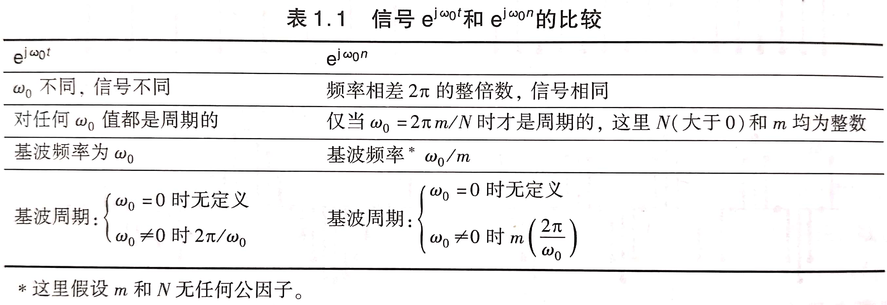

## 2 线性时不变系统

### 2.1 离散时间LTI系统：卷积和

**用脉冲表示离散时间信号**：$x[n]=\sum_{k=-\infty}^{+\infty}x[k]\delta[n-k]$

**卷积和**：$y[n]=\sum_{k=-\infty}^{+\infty}x[k]h[n-k]=x[n]*h[n]$

### 2.2 连续时间LTI系统：卷积积分

**用冲激表示连续时间信号**：$x(t)=\int_{-\infty}^{+\infty}x(\tau)\delta(t-\tau)d\tau$

**卷积积分**：$y(t)=\int_{-\infty}^{+\infty}x(\tau)h(t-\tau)d\tau=x(t)*h(t)$

### 2.3 LTI系统的性质

- 交换律、结合律、分配律
- 记忆/无记忆：$h(t)=K\delta(t),y[n]=K\delta[n]$
- 可逆/不可逆
- 因果/非因果：初始松弛条件（例如$h[n]=0,n<0$和$h(t)=0,t<0$）
- 稳定/不稳定：$\sum_{k=-\infty}^{+\infty}|h[k]|<\infty$，$\int_{-\infty}^{+\infty}|h(\tau)|d\tau<\infty$

### 2.4 差分和微分方程描述因果LTI系统

**线性常系数微分方程**：$\sum_{k=0}^{N}a_k\frac{d^{k}y(t)}{dt^k}=\sum_{k=0}^{M}\frac{d^kx(t)}{dt^k}$

**线性常系数差分方程**：$\sum_{k=0}^{N}a_ky[n-k]=\sum_{k=0}^{M}b_kx[n-k]$

## 3 周期信号的傅里叶级数表示

### 3.1 LTI系统对复指数信号的响应

**特征函数与特征值**：$x(t)=e^{st},x[n]=z^n$

- $y(t)=\int_{-\infty}^{+\infty}h(\tau)x(t-\tau)d\tau=e^{st}\int_{-\infty}^{+\infty}h(\tau)e^{-s\tau}d\tau=H(s)e^{st}$
	- $y(t)=\sum_{k}a_kH(s_k)e^{s_kt}$
- $y[n]=\sum_{k=-\infty}^{+\infty}h[k]x[n-k]=z^n\sum_{k=-\infty}^{+\infty}h[k]z^{-k}=H(z)z^n$
	- $y[n]=\sum_{k}a_kH(z_k)z_k^n$

### 3.2 连续时间周期信号的傅里叶级数表示

#### 3.2.1 连续时间周期信号的傅里叶级数

**连续时间周期信号傅里叶级数表示**：$x(t)=\sum_{k=-\infty}^{+\infty}a_ke^{jk\omega_0t}$

- 一次谐波分量（基波分量）、二次谐波分量...

**连续时间周期信号傅里叶级数表示的确定**：$a_k=\frac{1}{T}\int_{T}x(t)e^{-jk\omega_0t}dt$

- $a_0=\frac{1}{T}\int_{T}x(t)dt$，直流分量

#### 3.2.2 傅里叶级数的收敛

**狄里赫利条件**：

- 任何周期内$x(t)$绝对可积：$\int_{T}|x(t)|dt<\infty$
- 任意有限区间内，$x(t)$具有有限个起伏变化，即在任何单个周期内$x(t)$最大值和最小值的数目有限
- 任意有限区间内，只有有限个不连续点，且这些不连续点上函数值有限

#### 3.2.3 连续时间傅里叶级数性质

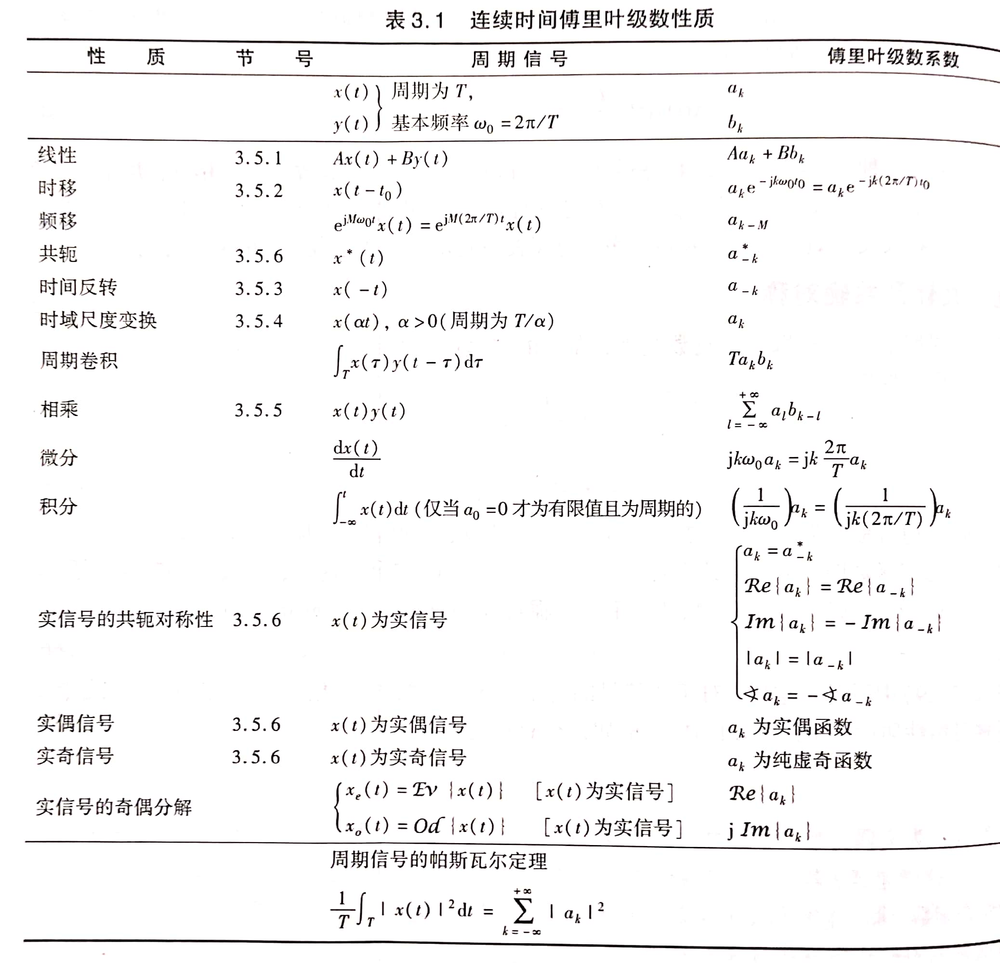

### 3.3 离散时间周期信号的傅里叶级数表示

#### 3.3.1 离散时间周期信号的傅里叶级数

**离散时间周期信号傅里叶级数表示**：$x[n]=\sum_{k=<N>}a_ke^{jk\omega_0n}$

**离散时间周期信号傅里叶级数表示的确定**：$a_k=\frac{1}{N}\sum_{n=<N>}x[n]e^{-jk\omega_0n}$

#### 3.3.2 离散时间傅里叶级数性质

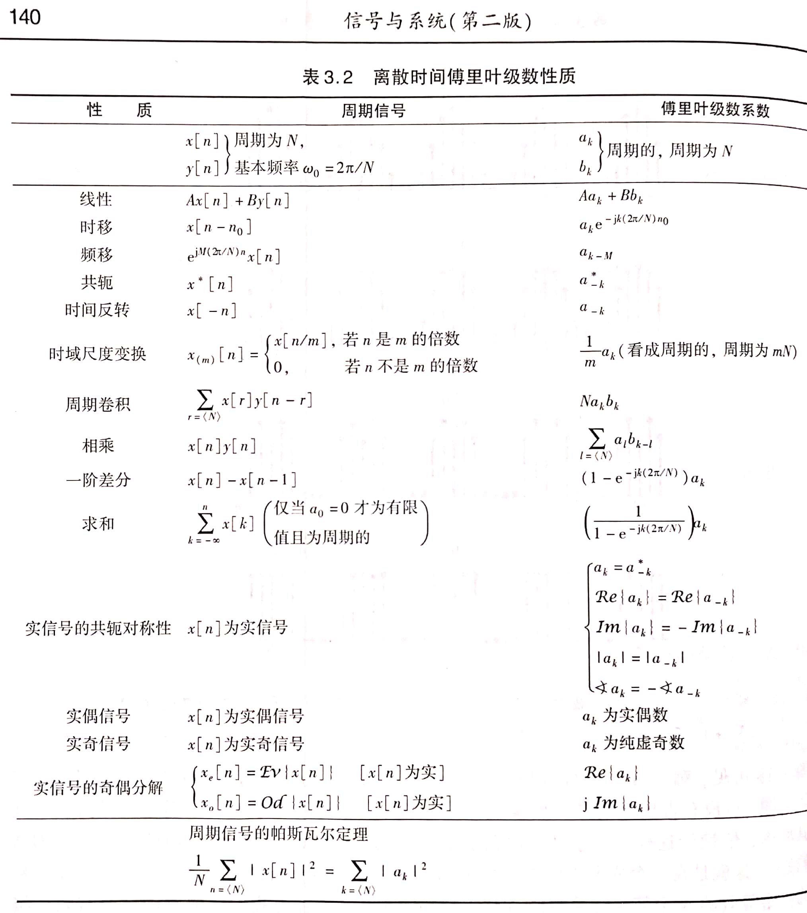

### 3.4 傅里叶级数与LTI系统

**系统函数**：$\begin{cases}H(s)=\int_{-\infty}^{+\infty}h(t)e^{-st}dt\\H(z)=\sum_{k=-\infty}^{+\infty}h[k]z^{-k}\end{cases}$

**频率响应**：$\begin{cases}H(j\omega)=\int_{-\infty}^{+\infty}h(t)e^{-j\omega t}dt\\H(e^{j\omega})=\sum_{k=-\infty}^{+\infty}h[k]e^{-j\omega n}\end{cases}$

- 已知$y(t)=x(t)*h(t)$，且$x(t)\longleftrightarrow a_k,y(t)\longleftrightarrow b_k$，则有$b_k=a_kH(jk\omega_0)$
- 已知$y[n]=x[n]*h[n]$，且$x[n]\longleftrightarrow a_k,y[n]\longleftrightarrow b_k$，则有$b_k=a_kH(e^{jk\omega_0})$

## 4 连续时间傅里叶变换

### 4.1 连续时间傅里叶变换

**傅里叶变换对**：$\begin{cases}X(j\omega)=\int_{-\infty}^{+\infty}x(t)e^{-j\omega t}dt\\x(t)=\frac{1}{2\pi}\int_{-\infty}^{+\infty}X(j\omega)e^{j\omega t}d\omega\end{cases}$

- $X(j\omega)$称为频谱

### 4.2 傅里叶变换的收敛

**狄里赫利条件**：

- $x(t)$绝对可积
- 任何有限区间内，$x(t)$只有有限个最大值和最小值
- 任何有限区间内，$x(t)$有有限个不连续点，且每个不连续点必为有限值

### 4.3 周期信号的傅里叶变换

$X(j\omega)=\sum_{k=-\infty}^{+\infty}2\pi a_k\delta(\omega-k\omega_0)$

### 4.4 连续时间傅里叶变换性质

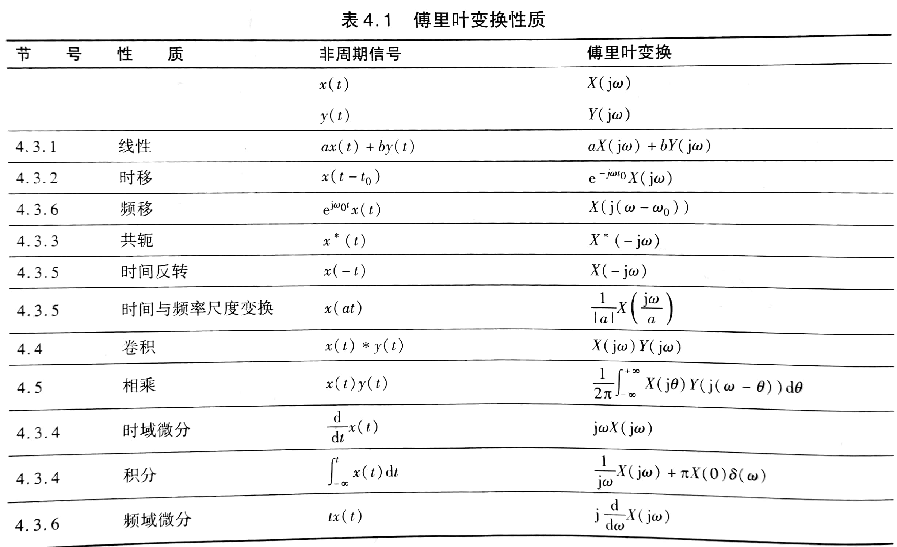

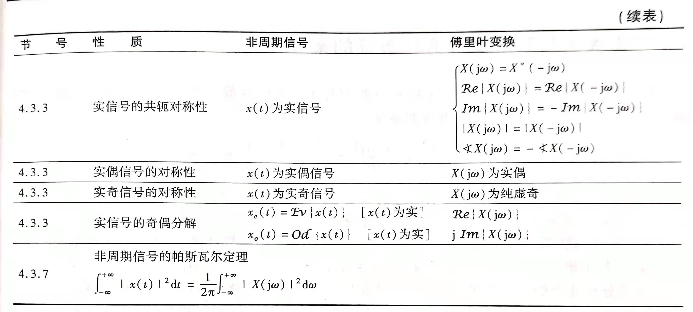

### 4.5 常见连续时间傅里叶变换对

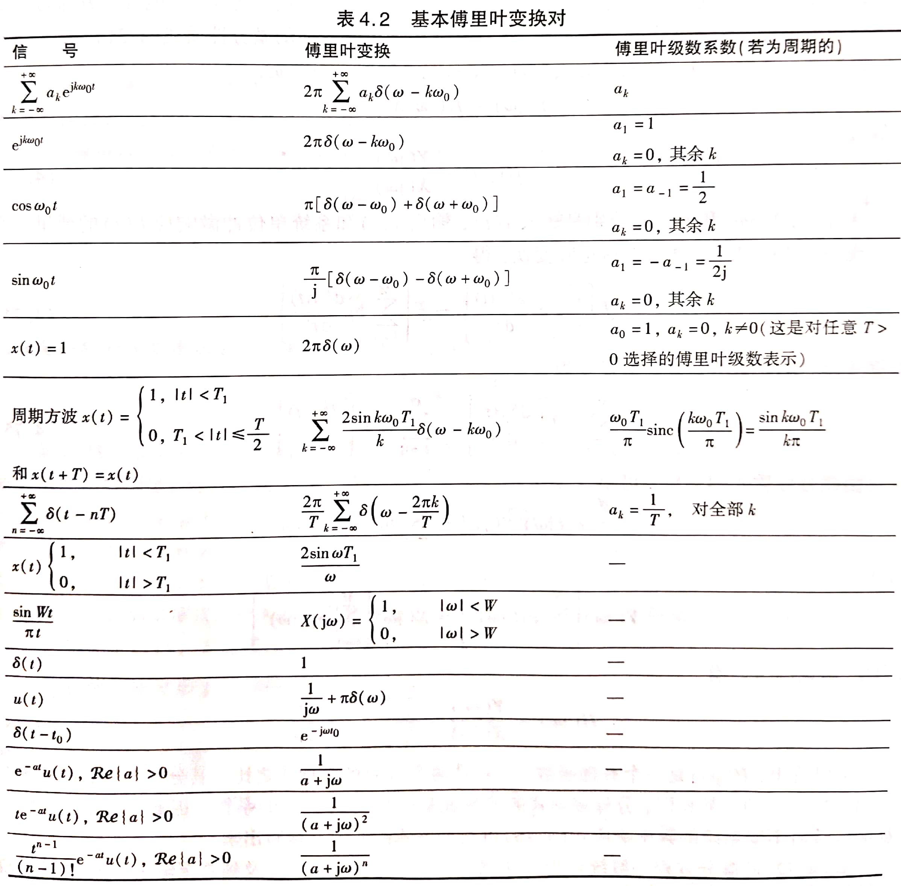

### 4.6 由线性常系数微分方程表征的系统

$\sum_{k=0}^{N}a_k\frac{d^{k}y(t)}{dt^k}=\sum_{k=0}^{M}b_k\frac{d^kx(t)}{dt^k}$

- 对两边进行傅里叶变换后得到：$\sum_{k=0}^{N}a_k(j\omega)^kY(j\omega)=\sum_{k=0}^{M}b_k(j\omega)^kX(j\omega)$
- $H(j\omega)=\frac{\sum_{k=0}^{M}b_k(j\omega)^k}{\sum_{k=0}^{N}a_k(j\omega)^k}$

## 5 离散时间傅里叶变换

### 5.1 离散时间傅里叶变换

**傅里叶变换对**：$\begin{cases}x[n]=\frac{1}{2\pi}\int_{2\pi}X(e^{j\omega})e^{j\omega n}d\omega\\X(e^{j\omega})=\sum_{n=-\infty}^{\infty}x[n]e^{-j\omega n}\end{cases}$

### 5.2 傅里叶变换的收敛

$\sum_{n=-\infty}^{\infty}|x[n]|^2<\infty$或$\sum_{n=-\infty}^{\infty}|x[n]|<\infty$，则$X(e^{j\omega})$存在，且收敛

### 5.3 周期信号的傅里叶变换

$X(e^{j\omega})=2\pi\sum_{k=-\infty}^{\infty}a_k\delta(w-\frac{2\pi}{N}k)$

### 5.4 离散时间傅里叶变换性质

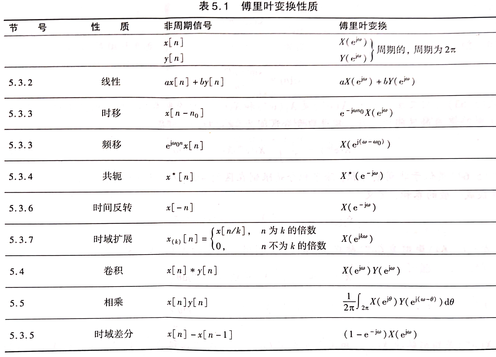

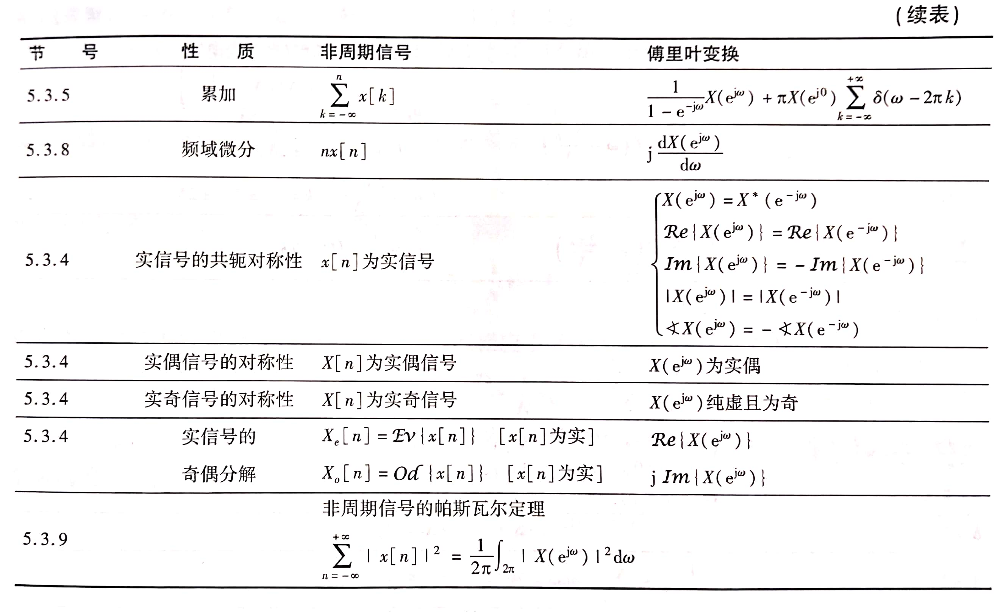

### 5.5 常见离散时间傅里叶变换对

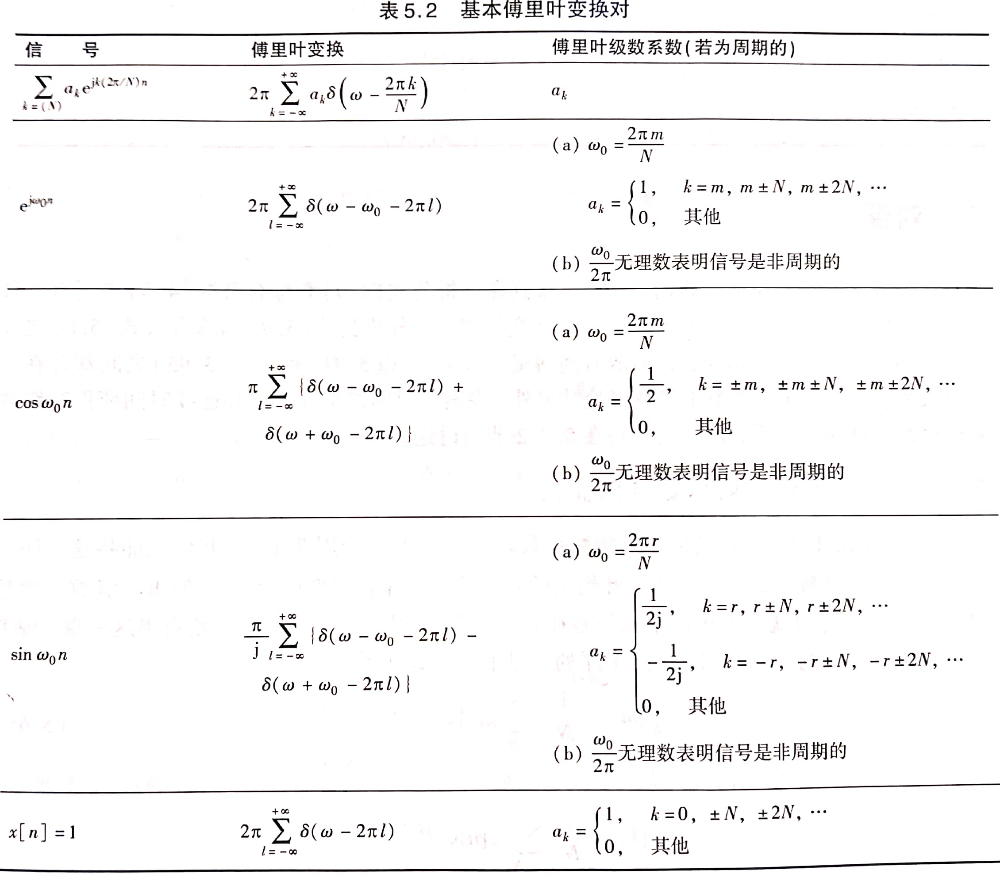

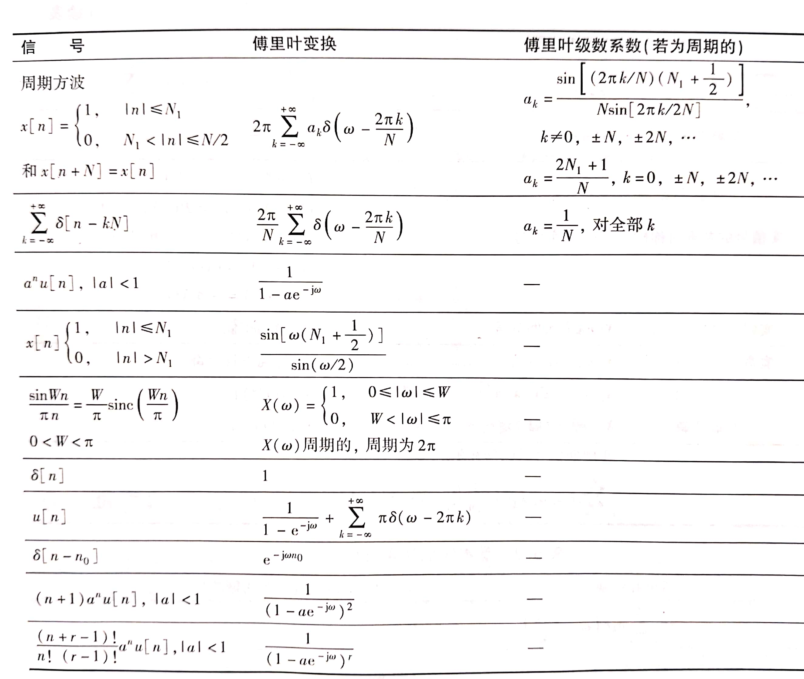

### 5.6 由线性常系数差分方程表征的系统

$\sum_{k=0}^{N}a_ky[n-k]=\sum_{k=0}^{M}b_kx[n-k]$

- $H(e^{j\omega})=\frac{Y(e^{j\omega})}{X(e^{j\omega})}=\frac{\sum_{k=0}^{M}b_ke^{-jk\omega}}{\sum_{k=0}^{N}a_ke^{-jk\omega}}$
- $h[n]$可由$H(e^{j\omega})$反变换得到

## 9 拉普拉斯变换

### 9.1 拉普拉斯变换

$\begin{cases}X(s)=\int_{-\infty}^{+\infty}x(t)e^{-st}dt\\x(t)=\frac{1}{2\pi j}\int_{\sigma-j\infty}^{\sigma+j\infty}X(s)e^{st}ds\end{cases}$

### 9.2 拉普拉斯变换收敛域

**ROC的性质**：

- ROC是S平面上平行于$j\omega$轴的带状区域
- 对于有理拉普拉斯变换，ROC内无极点
- 时限信号且该信号绝对可积，其ROC是整个S平面
- 右边信号的ROC是S平面内某一条平行于$j\omega$轴的直线的右边
- 左边信号的ROC是S平面内某一条平行于$j\omega$轴的直线的左边
- 双边信号的ROC如果存在，一定是S平面内平行于$j\omega$轴的带状区域

**有理拉普拉斯变换的ROC性质**：

- ROC总是由$X(s)$的极点分割
- 右边信号的ROC一定位于最右边极点的右边
- 左边信号的ROC一定位于最左边极点的左边
- 双边信号的ROC可以是任意两个相邻极点之间的带状区域

### 9.3 零极点图对傅里叶变换求值

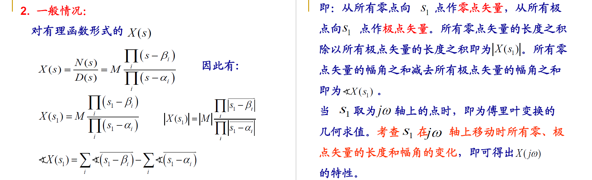

### 9.4 拉普拉斯变换的性质

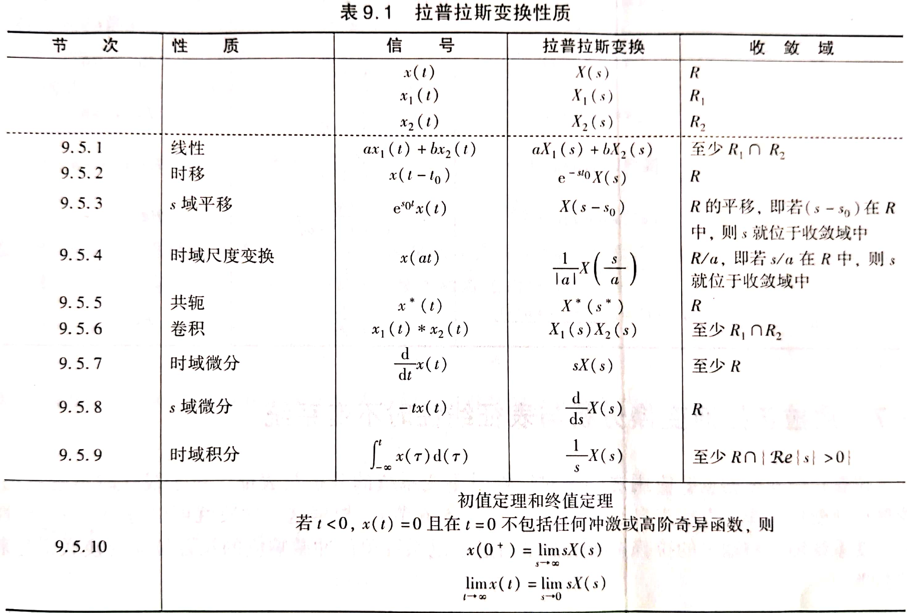

### 9.5 常见拉普拉斯变换对

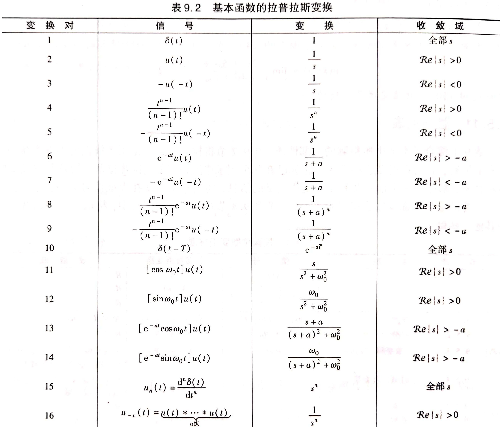

### 9.6 利用拉普拉斯变换分析与表征LTI系统

#### 9.6.1 因果性

**因果性**：

- 因果系统的$h(t)$是右边信号，其$H(s)$的ROC必是最右边极点的右边
- 反因果系统的$h(t)$是左边信号，其$H(s)$的ROC必是最左边极点的左边
- 只有当$H(s)$为有理函数时，系统的因果性等价于ROC为最右极点的右边

#### 9.6.2 稳定性

**稳定性**：

- 如果系统稳定，$H(s)$的ROC必然包括$j\omega$轴
- 因果稳定系统的$H(s)$，其全部极点必须位于S平面的左半边

#### 9.6.3 由线性常系数微分方程表征的LTI系统

$\sum_{k=0}^{N}a_k\frac{d^{k}y(t)}{dt^k}=\sum_{k=0}^{M}b_k\frac{d^kx(t)}{dt^k}$

- 拉氏变换得：$H(s)=\frac{Y(s)}{X(s)}=\frac{\sum_{k=0}^{M}b_ks^k}{\sum_{k=0}^{N}a_ks^k}=\frac{N(s)}{D(s)}$，是一个有理函数
- $H(s)$的ROC需要由系统得相关特性确定：
	- 如果LCCDE具有一组全为0的初始条件，则$H(s)$的ROCC必是最右边极点的右边
	- 如果LCCDE描述的系统是因果的，则$H(s)$的ROC必是最右边极点的右边
	- 如果LCCDE描述的系统是稳定的，则$H(s)$的ROC必包括$j\omega$轴

### 9.7 单边拉普拉斯变换

$\begin{cases}X(s)=\int_{0^-}^{\infty}x(t)e^{-st}dt\\x(t)=\frac{1}{2\pi j}\int_{\sigma-\infty}^{\sigma+\infty}X(s)e^{st}ds\end{cases}$

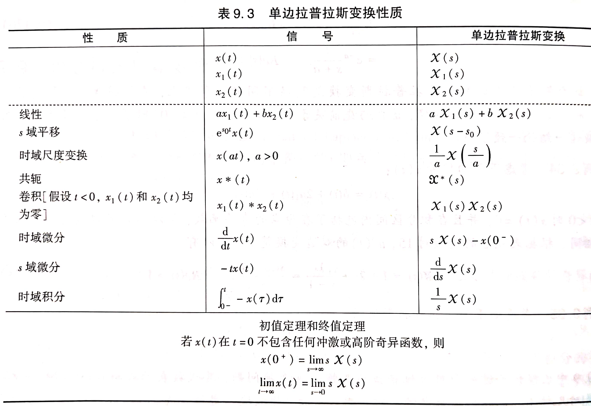

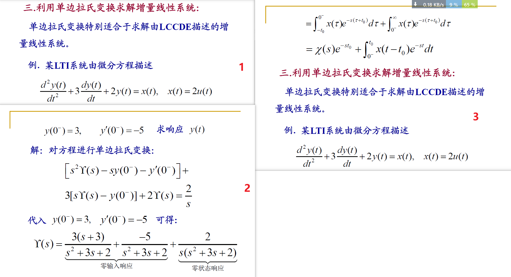

## 10 Z变换

### 10.1 Z变换

$\begin{cases}X(z)=\sum_{n=-\infty}^{+\infty}x[n]z^{-n}\\x[n]=\frac{1}{2\pi j}\oint X(z)z^{n-1}dz\end{cases}$

### 10.2 Z变换收敛域

**ROC性质**：

- $X(z)$的收敛域是在z平面内以远点为中心的圆环
- ROC内不包含任何极点
- 如果$x[n]$是有限长序列，则ROC为整个z平面，可能除去$z=0$或$z=\infty$
- 如果ROC为右边序列，且$|z|=r_0$的圆位于ROC内，则$|z|>r_0$的所有有限z值一定在ROC内
- 如果ROC为右边序列，且$|z|=r_0$的圆位于ROC内，则$0<|z|<r_0$的所有z值一定在ROC内
- 如果ROC为双边序列，且$|z|=r_0$的圆位于ROC内，ROC一定是包含该圆的环状区域

**有理ROC的性质**：

- ROC被极点界定或延伸至无穷远
- $x[n]$为右边序列，则ROC为最外极点的外部；如果$x[n]$还是因果序列，则ROC包括$z=\infty$
- $x[n]$为左边序列，则ROC为最内极点的内部；如果$x[n]$还是反因果序列，则ROC包括$z=0$

### 10.3 Z变换的性质

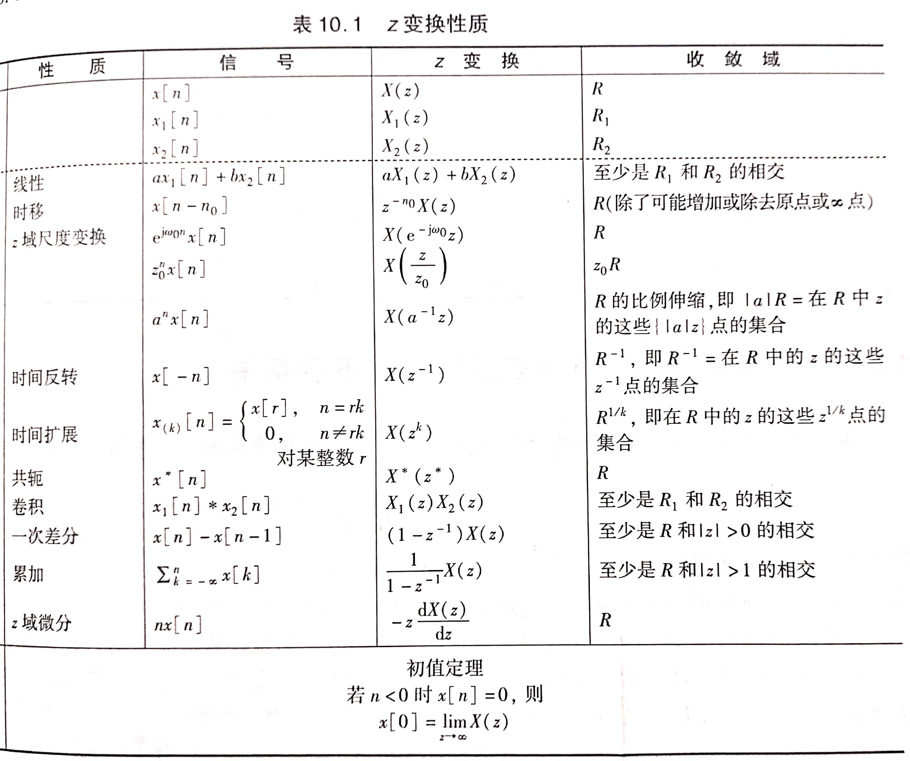

### 10.4 常见Z变换对

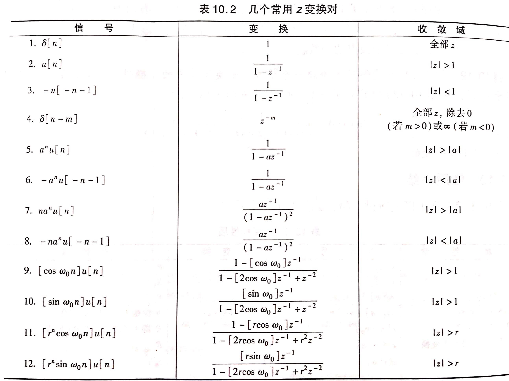

### 10.5 利用Z变换分析与表征LTI系统

#### 10.5.1 因果性

- 对于一个离散时间LTI系统，当且仅当系统函数的ROC在某个圆外部，且包含$z=\infty$时，系统是因果的
- 具有有理$H(z)$的LTI系统是因果的，当且仅当ROC位于最外极点外边的某个圆外部，且分子的阶次不能高于分母阶次

#### 10.5.2 稳定性

- 对于LTI系统，当且仅当系统函数$H(z)$的ROC包括单位元时，系统是稳定的
- 具有有理$H(z)$的因果LTI系统是稳定的，当且仅当$H(z)$的全部极点都位于单位圆内时

#### 10.5.3 由线性常系数差分方程表征的LTI系统

$\sum_{k=0}^{N}a_ky[n-k]=\sum_{k=0}^{M}b_kx[n-k]$

- Z变换得：$H(z)=\frac{Y(z)}{X(z)}=\frac{\sum_{k=0}^{M}b_kz^{-k}}{\sum_{k=0}^{N}a_kz^{-k}}$